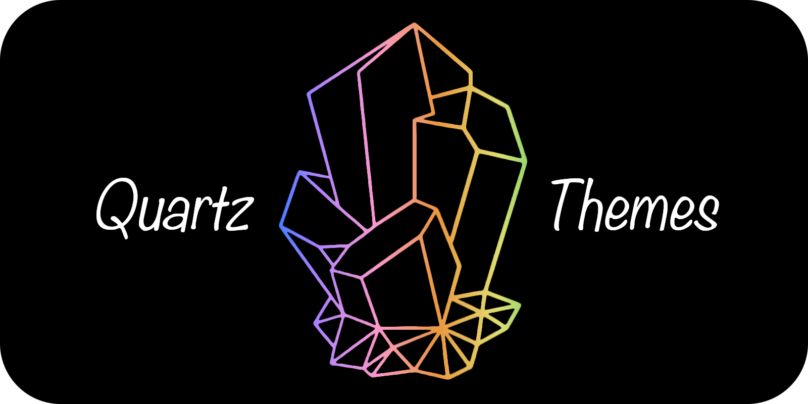
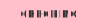

# Quartz Themes

A collection of [Obsidian](https://obsidian.md/) themes adapted for [Quartz](https://github.com/jackyzha0/quartz).

<p align="center" width="100%">
  
</p>
<!--
_<sub>left to right: `vauxhaul`, `tokyo-night`, `its-theme`, `absolutegruv`, `sandstorm`, `obsidian-nord`</sub>_
-->

&color=444>)
&color=444>)

<!--
Add goals:
 - Support all Obsidian themes in Quartz
 - Ease of use (auto-update, low maintenance)
 - Match styling as closely as possible (within reason)
-->

## Installation

### GitHub Actions (Recommended)

Add the following linte to your `deploy.yml` before the `permissions` section:

```yaml
env:
  THEME_NAME: <THEME-NAME>
```

And add the following lines to your `deploy.yml` before the `build` step:

```yaml
- name: Fetch Quartz Theme
  run: curl -s -S https://raw.githubusercontent.com/saberzero1/quartz-themes/master/action.sh | bash -s -- $THEME_NAME
```

> [!IMPORTANT]
> Replace `<THEME-NAME>` with your desired theme name. See [Compatibility List](#supported-themes)

> [!TIP]
> Example for Tokyo Night:
>
> ```yaml
> env:
>   THEME_NAME: tokyo-night
> ```

The full script would look like this:

```yaml
name: Deploy Quartz site to GitHub Pages

on:
  push:
    branches:
      - v4

env:
  THEME_NAME: <THEME-NAME>

permissions:
  contents: read
  pages: write
  id-token: write

concurrency:
  group: "pages"
  cancel-in-progress: false

jobs:
  build:
    runs-on: ubuntu-22.04
    steps:
      - uses: actions/checkout@v4
        with:
          fetch-depth: 0 # Fetch all history for git info
      - uses: actions/setup-node@v4
        with:
          node-version: 22
      - name: Install Dependencies
        run: npm ci
      - name: Fetch Quartz Theme
        run: curl -s -S https://raw.githubusercontent.com/saberzero1/quartz-themes/master/action.sh | bash -s -- $THEME_NAME
      - name: Build Quartz
        run: npx quartz build
      - name: Upload artifact
        uses: actions/upload-pages-artifact@v3
        with:
          path: public

  deploy:
    needs: build
    environment:
      name: github-pages
      url: ${{ steps.deployment.outputs.page_url }}
    runs-on: ubuntu-latest
    steps:
      - name: Deploy to GitHub Pages
        id: deployment
        uses: actions/deploy-pages@v4
```

### Automatic install into Quartz repository

> [!TIP]
> This installation method is recommended for users who want to install themes into their Quartz repository directly. This method is also recommended for user who cannot fetch dependencies during compilation.

Download the latest version of the [action.sh](https://raw.githubusercontent.com/saberzero1/quartz-themes/master/action.sh) script or run the following to download it:

```bash
curl -s -S -o action.sh https://raw.githubusercontent.com/saberzero1/quartz-themes/master/action.sh
```

> [!NOTE]
> Windows users should use `action.bat` instead, unless they also access to the bash shell (git-bash, etc.) or WSL.
>
> ```bash
> curl -s -S -o action.bat https://raw.githubusercontent.com/saberzero1/quartz-themes/master/action.bat
>
> action.bat tokyo-night
> ```

Then run the `action.sh` script with the desired theme to install it into your Quartz repository:

```bash
# Example: installing Tokyo Night...
./action.sh tokyo-night

# ...should output:
# Quartz root succesfully detected...
# Input theme: tokyo-night
# Parsing input theme...
# Theme tokyo-night parsed to tokyo-night
# Validating theme...
# Cleaning theme directory...
# Creating theme directory...
# Fetching theme files...
# Installing theme files...
# Applying patches...
# Verifying setup...
# Added import line to custom.scss...
# Finished fetching and applying theme 'tokyo-night'.
```

### Manual install

Manually download the `_index.scss` file from the [themes directory of your choice](./themes/) in this repository, and place it in your Quartz repository's at `quartz/styles/themes/_index.scss`. (Create the `themes` directory if it doesn't exist.)

Then, add the following line to your `src/styles/custom.scss` file after the `@use "base";` line:

```scss
@use "themes";
```

> [!IMPORTANT] For dark-only or light-only themes, remember to remove `Component.Darkmode()` from your `quartz.config.ts` file.

### Quartz Syncer

> [!IMPORTANT]
> This setup method is not yet available. It is currently being tested and will be released in the future.

## Supported Themes

<details>
  <summary>
    Glossary
  </summary>

| Status                                               | Description                                                                                                                                                        |
| ---------------------------------------------------- | ------------------------------------------------------------------------------------------------------------------------------------------------------------------ |
|                | Fully supported                                                                                                                                                    |
|          | Partially supported (see theme page for details)                                                                                                                   |
|    | This theme contains information for the [Style Settings plugin](https://github.com/mgmeyers/obsidian-style-settings). See the table for the configured sub-themes. |
|        | Testing compatibility                                                                                                                                              |
|          | Waiting for upstream fixes                                                                                                                                         |
|                | Not started                                                                                                                                                        |
|  | Won't support                                                                                                                                                      |
|           | Broken or removed from Obsidian                                                                                                                                    |

| Theme Modes                              | Description               |
| ---------------------------------------- | ------------------------- |
|    | Both dark and light theme |
|  | Light theme only          |
|    | Dark theme only           |

</details>
<!--
Compatibility table is built from the settings in `themes.json`
-->
//COMPATIBILITY_TABLE
