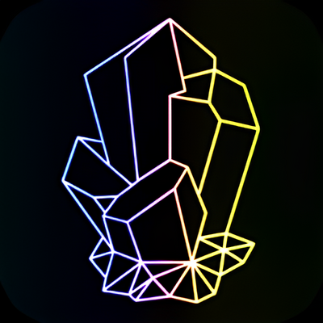

# Quartz Themes

A collection of Obsidian.md themes adapted for [Quartz](https://github.com/jackyzha0/quartz).

<p align="center" width="100%">
  
</p>

## Installation

### GitHub Actions (Recommended)

Add the following lines to your `deploy.yml` before the build step:

```yaml
- name: Fetch Quartz Theme
  run: curl -s -S https://raw.githubusercontent.com/saberzero1/quartz-themes/master/action.sh | bash -s -- <THEME-NAME>
```

> [!IMPORTANT]
> Replace `<THEME-NAME>` with your desired theme name. See [Compatibility List](#supported-themes)

> [!TIP]
> Example for Tokyo Night:
>
> ```yaml
> - name: Fetch Quartz Theme
>   run: curl -s -S https://raw.githubusercontent.com/saberzero1/quartz-themes/master/action.sh | bash -s -- Tokyo Night
> ```

The full script would look like this:

```yaml
name: Deploy Quartz site to GitHub Pages

on:
  push:
    branches:
      - v4

permissions:
  contents: read
  pages: write
  id-token: write

concurrency:
  group: "pages"
  cancel-in-progress: false

jobs:
  build:
    runs-on: ubuntu-22.04
    steps:
      - uses: actions/checkout@v4
        with:
          fetch-depth: 0 # Fetch all history for git info
      - uses: actions/setup-node@v4
        with:
          node-version: 22
      - name: Install Dependencies
        run: npm ci
      - name: Fetch Quartz Theme
        run: curl -s -S https://raw.githubusercontent.com/saberzero1/quartz-themes/master/action.sh | bash -s -- <THEME-NAME>
      - name: Build Quartz
        run: npx quartz build
      - name: Upload artifact
        uses: actions/upload-pages-artifact@v3
        with:
          path: public

  deploy:
    needs: build
    environment:
      name: github-pages
      url: ${{ steps.deployment.outputs.page_url }}
    runs-on: ubuntu-latest
    steps:
      - name: Deploy to GitHub Pages
        id: deployment
        uses: actions/deploy-pages@v4
```

### Manual install

Download the latest version of the [action.sh](https://raw.githubusercontent.com/saberzero1/quartz-themes/master/action.sh) script or run the following to download it:

```bash
curl -s -S -o action.sh https://raw.githubusercontent.com/saberzero1/quartz-themes/master/action.sh
```

Then run the `action.sh` script with the desired theme to install it into your Quartz repository:

```bash
# Example: installing Tokyo Night...
./action.sh Tokyo Night

# ...should output:
# Quartz root succesfully detected...
# Input theme: tokyo-night
# Parsing input theme...
# bash: line 49: tokyo-night: command not found
# Theme tokyo-night parsed to tokyo-night
# Validating theme...
# Theme 'tokyo-night' found. Preparing to fetch files...
# Cleaning theme directory...
# Creating theme directory...
# Fetching theme files...
# Checking theme files...
# _index.scss exists
# _fonts.scss exists
# _dark.scss exists
# _light.scss exists
# overrides/_index.scss exists
# Verifying setup...
# Added import line to custom.scss...
# Finished fetching and applying theme 'tokyo-night'.
```

### Install script (Advanced)

<details>
<summary>Advanced installation</summary>

> [!WARNING]
> This setup method is only recommended if the recommended method is not feasible.

Clone the project next to your Quartz repository.

```bash
git clone https://github.com/saberzero1/quartz-themes.git
cd quartz-themes
npm ci
```

#### Configure Quartz

Add the following line to your `custom.scss` file:

```scss
@use "./themes";
```

Your `custom.scss` should look something like this:

```scss
@use "./base.scss";
@use "./themes";

// put your custom CSS here!
```

#### Setting themes and layout

Run the following from the Quartz Themes project root:

```bash
npm run theme <theme-name>
```

#### Updating

Run the following from the Quartz Themes project root to check for updates:

```bash
npm run check
```

Run the following from the Quartz Themes project root to update the themes:

```bash
npm run update
```

</details>

## Supported Themes

<details>
  <summary>
    
    <span> <span>
    
  </summary>

| Status      | Description                                      |
| ----------- | ------------------------------------------------ |
| FULL        | Fully supported                                  |
| PARTIAL     | Partially supported (see theme page for details) |
| CHECKING    | Testing compatibility                            |
| BLOCKED     | Waiting for upstream fixes                       |
| TODO        | Not started                                      |
| UNSUPPORTED | Won't support                                    |
| BROKEN      | Broken or removed from Obsidian                  |

| Theme Modes | Description               |
| ----------- | ------------------------- |
| BOTH        | Both dark and light theme |
| LIGHT       | Light theme only          |
| DARK        | Dark theme only           |

</details>

| Mode | Obsidian Theme Name              | Theme Compatibility Status | Live Preview                                                                    |
| ---- | -------------------------------- | -------------------------- | ------------------------------------------------------------------------------- |
| DARK | `80s-neon`                       | FULL                       | [live preview](https://quartz-themes.github.io/80s-neon/)                       |
| BOTH | `abate`                          | CHECKING                   | [live preview](https://quartz-themes.github.io/abate/)                          |
| BOTH | `abecedarium`                    | CHECKING                   | [live preview](https://quartz-themes.github.io/abecedarium/)                    |
| BOTH | `absolutegruv`                   | CHECKING                   | [live preview](https://quartz-themes.github.io/absolutegruv/)                   |
| BOTH | `abyssal`                        | CHECKING                   | [live preview](https://quartz-themes.github.io/abyssal/)                        |
| BOTH | `adrenaline`                     | CHECKING                   | [live preview](https://quartz-themes.github.io/adrenaline/)                     |
| BOTH | `adwaita`                        | CHECKING                   | [live preview](https://quartz-themes.github.io/adwaita/)                        |
| BOTH | `agate`                          | CHECKING                   | [live preview](https://quartz-themes.github.io/agate/)                          |
| BOTH | `al-dente`                       | CHECKING                   | [live preview](https://quartz-themes.github.io/al-dente/)                       |
| BOTH | `allium`                         | CHECKING                   | [live preview](https://quartz-themes.github.io/allium/)                         |
| BOTH | `anuppuccin`                     | CHECKING                   | [live preview](https://quartz-themes.github.io/anuppuccin/)                     |
| BOTH | `apatheia`                       | CHECKING                   | [live preview](https://quartz-themes.github.io/apatheia/)                       |
| BOTH | `apex`                           | CHECKING                   | [live preview](https://quartz-themes.github.io/apex/)                           |
| BOTH | `arcane`                         | CHECKING                   | [live preview](https://quartz-themes.github.io/arcane/)                         |
| BOTH | `atom`                           | CHECKING                   | [live preview](https://quartz-themes.github.io/atom/)                           |
| BOTH | `atomus`                         | CHECKING                   | [live preview](https://quartz-themes.github.io/atomus/)                         |
| BOTH | `aura-dark`                      | CHECKING                   | [live preview](https://quartz-themes.github.io/aura-dark/)                      |
| BOTH | `aura`                           | CHECKING                   | [live preview](https://quartz-themes.github.io/aura/)                           |
| BOTH | `aurora-twilight`                | CHECKING                   | [live preview](https://quartz-themes.github.io/aurora-twilight/)                |
| BOTH | `aurora`                         | CHECKING                   | [live preview](https://quartz-themes.github.io/aurora/)                         |
| BOTH | `autotape`                       | CHECKING                   | [live preview](https://quartz-themes.github.io/autotape/)                       |
| BOTH | `ayu-light-mirage`               | CHECKING                   | [live preview](https://quartz-themes.github.io/ayu-light-mirage/)               |
| BOTH | `ayu-mirage`                     | CHECKING                   | [live preview](https://quartz-themes.github.io/ayu-mirage/)                     |
| BOTH | `base2tone`                      | CHECKING                   | [live preview](https://quartz-themes.github.io/base2tone/)                      |
| BOTH | `behave-dark`                    | CHECKING                   | [live preview](https://quartz-themes.github.io/behave-dark/)                    |
| BOTH | `big-bold`                       | CHECKING                   | [live preview](https://quartz-themes.github.io/big-bold/)                       |
| BOTH | `black`                          | CHECKING                   | [live preview](https://quartz-themes.github.io/black/)                          |
| BOTH | `blackbird`                      | CHECKING                   | [live preview](https://quartz-themes.github.io/blackbird/)                      |
| BOTH | `blossom`                        | CHECKING                   | [live preview](https://quartz-themes.github.io/blossom/)                        |
| BOTH | `blue-topaz`                     | CHECKING                   | [live preview](https://quartz-themes.github.io/blue-topaz/)                     |
| BOTH | `bolt`                           | CHECKING                   | [live preview](https://quartz-themes.github.io/bolt/)                           |
| BOTH | `border`                         | CHECKING                   | [live preview](https://quartz-themes.github.io/border/)                         |
| BOTH | `bossidian`                      | CHECKING                   | [live preview](https://quartz-themes.github.io/bossidian/)                      |
| BOTH | `brainhack`                      | CHECKING                   | [live preview](https://quartz-themes.github.io/brainhack/)                      |
| BOTH | `brutalism`                      | CHECKING                   | [live preview](https://quartz-themes.github.io/brutalism/)                      |
| BOTH | `buena-vista`                    | CHECKING                   | [live preview](https://quartz-themes.github.io/buena-vista/)                    |
| BOTH | `carbon`                         | CHECKING                   | [live preview](https://quartz-themes.github.io/carbon/)                         |
| BOTH | `cardstock`                      | CHECKING                   | [live preview](https://quartz-themes.github.io/cardstock/)                      |
| BOTH | `catppuccin`                     | CHECKING                   | [live preview](https://quartz-themes.github.io/catppuccin/)                     |
| BOTH | `celestial-night`                | CHECKING                   | [live preview](https://quartz-themes.github.io/celestial-night/)                |
| BOTH | `charcoal`                       | CHECKING                   | [live preview](https://quartz-themes.github.io/charcoal/)                       |
| BOTH | `chiaroscuroflow`                | CHECKING                   | [live preview](https://quartz-themes.github.io/chiaroscuroflow/)                |
| BOTH | `chime` (🔔-chime)               | CHECKING                   | [live preview](https://quartz-themes.github.io/chime/)                          |
| BOTH | `christmas`                      | CHECKING                   | [live preview](https://quartz-themes.github.io/christmas/)                      |
| BOTH | `cobalt-peacock`                 | CHECKING                   | [live preview](https://quartz-themes.github.io/cobalt-peacock/)                 |
| BOTH | `colored-candy`                  | CHECKING                   | [live preview](https://quartz-themes.github.io/colored-candy/)                  |
| BOTH | `comfort-color-dark`             | CHECKING                   | [live preview](https://quartz-themes.github.io/comfort-color-dark/)             |
| BOTH | `comfort-dark`                   | CHECKING                   | [live preview](https://quartz-themes.github.io/comfort-dark/)                   |
| BOTH | `comfort-smooth`                 | CHECKING                   | [live preview](https://quartz-themes.github.io/comfort-smooth/)                 |
| BOTH | `comfort`                        | CHECKING                   | [live preview](https://quartz-themes.github.io/comfort/)                        |
| BOTH | `covert`                         | CHECKING                   | [live preview](https://quartz-themes.github.io/covert/)                         |
| BOTH | `creature`                       | CHECKING                   | [live preview](https://quartz-themes.github.io/creature/)                       |
| BOTH | `creme-brulee`                   | CHECKING                   | [live preview](https://quartz-themes.github.io/creme-brulee/)                   |
| BOTH | `cyber-glow`                     | CHECKING                   | [live preview](https://quartz-themes.github.io/cyber-glow/)                     |
| BOTH | `cybertron-shifted`              | CHECKING                   | [live preview](https://quartz-themes.github.io/cybertron-shifted/)              |
| BOTH | `cybertron`                      | CHECKING                   | [live preview](https://quartz-themes.github.io/cybertron/)                      |
| BOTH | `dark-castle`                    | CHECKING                   | [live preview](https://quartz-themes.github.io/dark-castle/)                    |
| BOTH | `dark-clarity`                   | CHECKING                   | [live preview](https://quartz-themes.github.io/dark-clarity/)                   |
| BOTH | `dark-graphite-pie`              | CHECKING                   | [live preview](https://quartz-themes.github.io/dark-graphite-pie/)              |
| BOTH | `dark-graphite`                  | CHECKING                   | [live preview](https://quartz-themes.github.io/dark-graphite/)                  |
| BOTH | `dark-moss`                      | CHECKING                   | [live preview](https://quartz-themes.github.io/dark-moss/)                      |
| BOTH | `darkember`                      | CHECKING                   | [live preview](https://quartz-themes.github.io/darkember/)                      |
| BOTH | `darkyan`                        | CHECKING                   | [live preview](https://quartz-themes.github.io/darkyan/)                        |
| BOTH | `dawn`                           | CHECKING                   | [live preview](https://quartz-themes.github.io/dawn/)                           |
| BOTH | `dayspring`                      | CHECKING                   | [live preview](https://quartz-themes.github.io/dayspring/)                      |
| BOTH | `deeper-work`                    | CHECKING                   | [live preview](https://quartz-themes.github.io/deeper-work/)                    |
| BOTH | `default`                        | CHECKING                   | [live preview](https://quartz-themes.github.io/default/)                        |
| BOTH | `dekurai`                        | CHECKING                   | [live preview](https://quartz-themes.github.io/dekurai/)                        |
| BOTH | `discordian`                     | CHECKING                   | [live preview](https://quartz-themes.github.io/discordian/)                     |
| BOTH | `dracula-for-obsidian`           | CHECKING                   | [live preview](https://quartz-themes.github.io/dracula-for-obsidian/)           |
| BOTH | `dracula-gemini`                 | CHECKING                   | [live preview](https://quartz-themes.github.io/dracula-gemini/)                 |
| BOTH | `dracula-lyt`                    | CHECKING                   | [live preview](https://quartz-themes.github.io/dracula-lyt/)                    |
| BOTH | `dracula-official`               | CHECKING                   | [live preview](https://quartz-themes.github.io/dracula-official/)               |
| BOTH | `dracula-plus`                   | CHECKING                   | [live preview](https://quartz-themes.github.io/dracula-plus/)                   |
| BOTH | `dracula-slim`                   | CHECKING                   | [live preview](https://quartz-themes.github.io/dracula-slim/)                   |
| BOTH | `dune`                           | CHECKING                   | [live preview](https://quartz-themes.github.io/dune/)                           |
| BOTH | `dunite`                         | CHECKING                   | [live preview](https://quartz-themes.github.io/dunite/)                         |
| BOTH | `dynamic-color`                  | CHECKING                   | [live preview](https://quartz-themes.github.io/dynamic-color/)                  |
| BOTH | `ebullientworks`                 | CHECKING                   | [live preview](https://quartz-themes.github.io/ebullientworks/)                 |
| BOTH | `eldritch`                       | CHECKING                   | [live preview](https://quartz-themes.github.io/eldritch/)                       |
| BOTH | `elegance`                       | CHECKING                   | [live preview](https://quartz-themes.github.io/elegance/)                       |
| BOTH | `encore`                         | CHECKING                   | [live preview](https://quartz-themes.github.io/encore/)                         |
| BOTH | `ethereon`                       | CHECKING                   | [live preview](https://quartz-themes.github.io/ethereon/)                       |
| BOTH | `everblush`                      | CHECKING                   | [live preview](https://quartz-themes.github.io/everblush/)                      |
| BOTH | `everforest-enchanted`           | CHECKING                   | [live preview](https://quartz-themes.github.io/everforest-enchanted/)           |
| BOTH | `everforest`                     | CHECKING                   | [live preview](https://quartz-themes.github.io/everforest/)                     |
| BOTH | `evergreen-shadow`               | CHECKING                   | [live preview](https://quartz-themes.github.io/evergreen-shadow/)               |
| BOTH | `evilred`                        | CHECKING                   | [live preview](https://quartz-themes.github.io/evilred/)                        |
| BOTH | `faded`                          | CHECKING                   | [live preview](https://quartz-themes.github.io/faded/)                          |
| BOTH | `feather`                        | CHECKING                   | [live preview](https://quartz-themes.github.io/feather/)                        |
| BOTH | `firefly`                        | CHECKING                   | [live preview](https://quartz-themes.github.io/firefly/)                        |
| BOTH | `flexoki`                        | CHECKING                   | [live preview](https://quartz-themes.github.io/flexoki/)                        |
| BOTH | `focus`                          | CHECKING                   | [live preview](https://quartz-themes.github.io/focus/)                          |
| BOTH | `fusion`                         | CHECKING                   | [live preview](https://quartz-themes.github.io/fusion/)                         |
| BOTH | `garden-gnome-adwaita-gtk`       | CHECKING                   | [live preview](https://quartz-themes.github.io/garden-gnome-adwaita-gtk/)       |
| BOTH | `gdct-dark`                      | CHECKING                   | [live preview](https://quartz-themes.github.io/gdct-dark/)                      |
| BOTH | `gdct`                           | CHECKING                   | [live preview](https://quartz-themes.github.io/gdct/)                           |
| BOTH | `github-theme`                   | CHECKING                   | [live preview](https://quartz-themes.github.io/github-theme/)                   |
| BOTH | `githubdhc`                      | CHECKING                   | [live preview](https://quartz-themes.github.io/githubdhc/)                      |
| BOTH | `gitsidian`                      | CHECKING                   | [live preview](https://quartz-themes.github.io/gitsidian/)                      |
| BOTH | `golden-topaz`                   | CHECKING                   | [live preview](https://quartz-themes.github.io/golden-topaz/)                   |
| BOTH | `green-nightmare`                | CHECKING                   | [live preview](https://quartz-themes.github.io/green-nightmare/)                |
| BOTH | `gummy-revived`                  | CHECKING                   | [live preview](https://quartz-themes.github.io/gummy-revived/)                  |
| BOTH | `halcyon`                        | CHECKING                   | [live preview](https://quartz-themes.github.io/halcyon/)                        |
| BOTH | `heboric`                        | CHECKING                   | [live preview](https://quartz-themes.github.io/heboric/)                        |
| BOTH | `hipstersmoothie`                | CHECKING                   | [live preview](https://quartz-themes.github.io/hipstersmoothie/)                |
| BOTH | `hulk`                           | CHECKING                   | [live preview](https://quartz-themes.github.io/hulk/)                           |
| BOTH | `ia-writer`                      | CHECKING                   | [live preview](https://quartz-themes.github.io/ia-writer/)                      |
| BOTH | `ib-writer`                      | CHECKING                   | [live preview](https://quartz-themes.github.io/ib-writer/)                      |
| BOTH | `iceberg`                        | CHECKING                   | [live preview](https://quartz-themes.github.io/iceberg/)                        |
| BOTH | `improved-potato`                | CHECKING                   | [live preview](https://quartz-themes.github.io/improved-potato/)                |
| BOTH | `ion`                            | CHECKING                   | [live preview](https://quartz-themes.github.io/ion/)                            |
| BOTH | `its-theme`                      | CHECKING                   | [live preview](https://quartz-themes.github.io/its-theme/)                      |
| BOTH | `jotter`                         | CHECKING                   | [live preview](https://quartz-themes.github.io/jotter/)                         |
| BOTH | `kakano`                         | CHECKING                   | [live preview](https://quartz-themes.github.io/kakano/)                         |
| BOTH | `kanagawa`                       | CHECKING                   | [live preview](https://quartz-themes.github.io/kanagawa/)                       |
| BOTH | `kiwi-mono`                      | CHECKING                   | [live preview](https://quartz-themes.github.io/kiwi-mono/)                      |
| BOTH | `kurokula`                       | CHECKING                   | [live preview](https://quartz-themes.github.io/kurokula/)                       |
| BOTH | `latex`                          | CHECKING                   | [live preview](https://quartz-themes.github.io/latex/)                          |
| BOTH | `lavender-mist`                  | CHECKING                   | [live preview](https://quartz-themes.github.io/lavender-mist/)                  |
| BOTH | `lemons-theme`                   | CHECKING                   | [live preview](https://quartz-themes.github.io/lemons-theme/)                   |
| BOTH | `light-bright`                   | CHECKING                   | [live preview](https://quartz-themes.github.io/light-bright/)                   |
| BOTH | `listive`                        | CHECKING                   | [live preview](https://quartz-themes.github.io/listive/)                        |
| BOTH | `lorens`                         | CHECKING                   | [live preview](https://quartz-themes.github.io/lorens/)                         |
| BOTH | `lumines`                        | CHECKING                   | [live preview](https://quartz-themes.github.io/lumines/)                        |
| BOTH | `lyt-mode`                       | CHECKING                   | [live preview](https://quartz-themes.github.io/lyt-mode/)                       |
| BOTH | `mado-11`                        | CHECKING                   | [live preview](https://quartz-themes.github.io/mado-11/)                        |
| BOTH | `mado-miniflow`                  | CHECKING                   | [live preview](https://quartz-themes.github.io/mado-miniflow/)                  |
| BOTH | `magicuser`                      | CHECKING                   | [live preview](https://quartz-themes.github.io/magicuser/)                      |
| BOTH | `mammoth`                        | CHECKING                   | [live preview](https://quartz-themes.github.io/mammoth/)                        |
| BOTH | `maple`                          | CHECKING                   | [live preview](https://quartz-themes.github.io/maple/)                          |
| BOTH | `material-flat`                  | CHECKING                   | [live preview](https://quartz-themes.github.io/material-flat/)                  |
| BOTH | `material-gruvbox`               | CHECKING                   | [live preview](https://quartz-themes.github.io/material-gruvbox/)               |
| BOTH | `material-ocean`                 | CHECKING                   | [live preview](https://quartz-themes.github.io/material-ocean/)                 |
| BOTH | `micro-mike`                     | CHECKING                   | [live preview](https://quartz-themes.github.io/micro-mike/)                     |
| BOTH | `midnight-fjord`                 | CHECKING                   | [live preview](https://quartz-themes.github.io/midnight-fjord/)                 |
| BOTH | `midnight`                       | CHECKING                   | [live preview](https://quartz-themes.github.io/midnight/)                       |
| BOTH | `minimal-edge`                   | CHECKING                   | [live preview](https://quartz-themes.github.io/minimal-edge/)                   |
| BOTH | `minimal-resources`              | CHECKING                   | [live preview](https://quartz-themes.github.io/minimal-resources/)              |
| BOTH | `minimal`                        | CHECKING                   | [live preview](https://quartz-themes.github.io/minimal/)                        |
| BOTH | `mint-breeze`                    | CHECKING                   | [live preview](https://quartz-themes.github.io/mint-breeze/)                    |
| BOTH | `mistymauve`                     | CHECKING                   | [live preview](https://quartz-themes.github.io/mistymauve/)                     |
| BOTH | `mono-black-monochrome-charcoal` | CHECKING                   | [live preview](https://quartz-themes.github.io/mono-black-monochrome-charcoal/) |
| BOTH | `monochroyou`                    | CHECKING                   | [live preview](https://quartz-themes.github.io/monochroyou/)                    |
| BOTH | `monokai`                        | CHECKING                   | [live preview](https://quartz-themes.github.io/monokai/)                        |
| BOTH | `moonlight`                      | CHECKING                   | [live preview](https://quartz-themes.github.io/moonlight/)                      |
| BOTH | `muted-blue`                     | CHECKING                   | [live preview](https://quartz-themes.github.io/muted-blue/)                     |
| BOTH | `nebula`                         | CHECKING                   | [live preview](https://quartz-themes.github.io/nebula/)                         |
| BOTH | `neo`                            | CHECKING                   | [live preview](https://quartz-themes.github.io/neo/)                            |
| BOTH | `neon-synthwave`                 | CHECKING                   | [live preview](https://quartz-themes.github.io/neon-synthwave/)                 |
| BOTH | `neovim`                         | CHECKING                   | [live preview](https://quartz-themes.github.io/neovim/)                         |
| BOTH | `neuborder`                      | CHECKING                   | [live preview](https://quartz-themes.github.io/neuborder/)                      |
| BOTH | `nier`                           | CHECKING                   | [live preview](https://quartz-themes.github.io/nier/)                           |
| BOTH | `nightfox`                       | CHECKING                   | [live preview](https://quartz-themes.github.io/nightfox/)                       |
| BOTH | `nightingale`                    | CHECKING                   | [live preview](https://quartz-themes.github.io/nightingale/)                    |
| BOTH | `nobb`                           | CHECKING                   | [live preview](https://quartz-themes.github.io/nobb/)                           |
| BOTH | `nordic`                         | CHECKING                   | [live preview](https://quartz-themes.github.io/nordic/)                         |
| BOTH | `northern-sky`                   | CHECKING                   | [live preview](https://quartz-themes.github.io/northern-sky/)                   |
| BOTH | `notation-2`                     | CHECKING                   | [live preview](https://quartz-themes.github.io/notation-2/)                     |
| BOTH | `notation`                       | CHECKING                   | [live preview](https://quartz-themes.github.io/notation/)                       |
| BOTH | `notswift`                       | CHECKING                   | [live preview](https://quartz-themes.github.io/notswift/)                       |
| BOTH | `novadust`                       | CHECKING                   | [live preview](https://quartz-themes.github.io/novadust/)                       |
| BOTH | `obsidian-boom`                  | CHECKING                   | [live preview](https://quartz-themes.github.io/obsidian-boom/)                  |
| BOTH | `obsidian-gruvbox`               | CHECKING                   | [live preview](https://quartz-themes.github.io/obsidian-gruvbox/)               |
| BOTH | `obsidian-nord`                  | CHECKING                   | [live preview](https://quartz-themes.github.io/obsidian-nord/)                  |
| BOTH | `obsidian_ia`                    | CHECKING                   | [live preview](https://quartz-themes.github.io/obsidian_ia/)                    |
| BOTH | `obsidianite`                    | CHECKING                   | [live preview](https://quartz-themes.github.io/obsidianite/)                    |
| BOTH | `obsidianotion`                  | CHECKING                   | [live preview](https://quartz-themes.github.io/obsidianotion/)                  |
| BOTH | `obuntu`                         | CHECKING                   | [live preview](https://quartz-themes.github.io/obuntu/)                         |
| BOTH | `oistnb`                         | CHECKING                   | [live preview](https://quartz-themes.github.io/oistnb/)                         |
| BOTH | `oldsidian-purple`               | CHECKING                   | [live preview](https://quartz-themes.github.io/oldsidian-purple/)               |
| BOTH | `oliviers-theme`                 | CHECKING                   | [live preview](https://quartz-themes.github.io/oliviers-theme/)                 |
| BOTH | `ono-sendai`                     | CHECKING                   | [live preview](https://quartz-themes.github.io/ono-sendai/)                     |
| BOTH | `oreo`                           | CHECKING                   | [live preview](https://quartz-themes.github.io/oreo/)                           |
| BOTH | `origin`                         | CHECKING                   | [live preview](https://quartz-themes.github.io/origin/)                         |
| BOTH | `pale`                           | CHECKING                   | [live preview](https://quartz-themes.github.io/pale/)                           |
| BOTH | `panic-mode`                     | CHECKING                   | [live preview](https://quartz-themes.github.io/panic-mode/)                     |
| BOTH | `penumbra`                       | CHECKING                   | [live preview](https://quartz-themes.github.io/penumbra/)                       |
| BOTH | `perso`                          | CHECKING                   | [live preview](https://quartz-themes.github.io/perso/)                          |
| BOTH | `phoenix`                        | CHECKING                   | [live preview](https://quartz-themes.github.io/phoenix/)                        |
| BOTH | `pine-forest-berry`              | CHECKING                   | [live preview](https://quartz-themes.github.io/pine-forest-berry/)              |
| BOTH | `pink-topaz`                     | CHECKING                   | [live preview](https://quartz-themes.github.io/pink-topaz/)                     |
| BOTH | `pisum`                          | CHECKING                   | [live preview](https://quartz-themes.github.io/pisum/)                          |
| BOTH | `pln`                            | CHECKING                   | [live preview](https://quartz-themes.github.io/pln/)                            |
| BOTH | `poimandres`                     | CHECKING                   | [live preview](https://quartz-themes.github.io/poimandres/)                     |
| BOTH | `polka`                          | CHECKING                   | [live preview](https://quartz-themes.github.io/polka/)                          |
| BOTH | `primary`                        | CHECKING                   | [live preview](https://quartz-themes.github.io/primary/)                        |
| BOTH | `prime`                          | CHECKING                   | [live preview](https://quartz-themes.github.io/prime/)                          |
| BOTH | `prism`                          | CHECKING                   | [live preview](https://quartz-themes.github.io/prism/)                          |
| BOTH | `proper-dark`                    | CHECKING                   | [live preview](https://quartz-themes.github.io/proper-dark/)                    |
| BOTH | `protocolblue`                   | CHECKING                   | [live preview](https://quartz-themes.github.io/protocolblue/)                   |
| BOTH | `prussian-blue`                  | CHECKING                   | [live preview](https://quartz-themes.github.io/prussian-blue/)                  |
| BOTH | `pure`                           | CHECKING                   | [live preview](https://quartz-themes.github.io/pure/)                           |
| BOTH | `purple-aurora`                  | CHECKING                   | [live preview](https://quartz-themes.github.io/purple-aurora/)                  |
| BOTH | `purple-owl`                     | CHECKING                   | [live preview](https://quartz-themes.github.io/purple-owl/)                     |
| BOTH | `pxld`                           | CHECKING                   | [live preview](https://quartz-themes.github.io/pxld/)                           |
| BOTH | `qlean`                          | CHECKING                   | [live preview](https://quartz-themes.github.io/qlean/)                          |
| BOTH | `red-graphite`                   | CHECKING                   | [live preview](https://quartz-themes.github.io/red-graphite/)                   |
| BOTH | `refined-default`                | CHECKING                   | [live preview](https://quartz-themes.github.io/refined-default/)                |
| BOTH | `reshi`                          | CHECKING                   | [live preview](https://quartz-themes.github.io/reshi/)                          |
| BOTH | `retronotes`                     | CHECKING                   | [live preview](https://quartz-themes.github.io/retronotes/)                     |
| BOTH | `reverie`                        | CHECKING                   | [live preview](https://quartz-themes.github.io/reverie/)                        |
| BOTH | `rezin`                          | CHECKING                   | [live preview](https://quartz-themes.github.io/rezin/)                          |
| BOTH | `rift`                           | CHECKING                   | [live preview](https://quartz-themes.github.io/rift/)                           |
| BOTH | `rmaki`                          | CHECKING                   | [live preview](https://quartz-themes.github.io/rmaki/)                          |
| BOTH | `rose-pine-moon`                 | CHECKING                   | [live preview](https://quartz-themes.github.io/rose-pine-moon/)                 |
| BOTH | `rose-pine`                      | CHECKING                   | [live preview](https://quartz-themes.github.io/rose-pine/)                      |
| BOTH | `rose-red`                       | CHECKING                   | [live preview](https://quartz-themes.github.io/rose-red/)                       |
| BOTH | `royal-velvet`                   | CHECKING                   | [live preview](https://quartz-themes.github.io/royal-velvet/)                   |
| BOTH | `salem`                          | CHECKING                   | [live preview](https://quartz-themes.github.io/salem/)                          |
| BOTH | `sanctum-reborn`                 | CHECKING                   | [live preview](https://quartz-themes.github.io/sanctum-reborn/)                 |
| BOTH | `sanctum`                        | CHECKING                   | [live preview](https://quartz-themes.github.io/sanctum/)                        |
| BOTH | `sandover`                       | CHECKING                   | [live preview](https://quartz-themes.github.io/sandover/)                       |
| BOTH | `sandstorm`                      | CHECKING                   | [live preview](https://quartz-themes.github.io/sandstorm/)                      |
| BOTH | `sanguine`                       | CHECKING                   | [live preview](https://quartz-themes.github.io/sanguine/)                       |
| BOTH | `sea-glass`                      | CHECKING                   | [live preview](https://quartz-themes.github.io/sea-glass/)                      |
| BOTH | `seamless-view`                  | CHECKING                   | [live preview](https://quartz-themes.github.io/seamless-view/)                  |
| BOTH | `serika`                         | CHECKING                   | [live preview](https://quartz-themes.github.io/serika/)                         |
| BOTH | `shade-sanctuary`                | CHECKING                   | [live preview](https://quartz-themes.github.io/shade-sanctuary/)                |
| BOTH | `shiba-inu`                      | CHECKING                   | [live preview](https://quartz-themes.github.io/shiba-inu/)                      |
| BOTH | `shimmering-focus`               | CHECKING                   | [live preview](https://quartz-themes.github.io/shimmering-focus/)               |
| BOTH | `simple`                         | CHECKING                   | [live preview](https://quartz-themes.github.io/simple/)                         |
| BOTH | `simplicity`                     | CHECKING                   | [live preview](https://quartz-themes.github.io/simplicity/)                     |
| BOTH | `sodalite`                       | CHECKING                   | [live preview](https://quartz-themes.github.io/sodalite/)                       |
| BOTH | `solarized`                      | CHECKING                   | [live preview](https://quartz-themes.github.io/solarized/)                      |
| BOTH | `solitude`                       | CHECKING                   | [live preview](https://quartz-themes.github.io/solitude/)                       |
| BOTH | `soloing`                        | CHECKING                   | [live preview](https://quartz-themes.github.io/soloing/)                        |
| BOTH | `soothe`                         | CHECKING                   | [live preview](https://quartz-themes.github.io/soothe/)                         |
| BOTH | `space`                          | CHECKING                   | [live preview](https://quartz-themes.github.io/space/)                          |
| BOTH | `sparkling-day`                  | CHECKING                   | [live preview](https://quartz-themes.github.io/sparkling-day/)                  |
| BOTH | `sparkling-night`                | CHECKING                   | [live preview](https://quartz-themes.github.io/sparkling-night/)                |
| BOTH | `sparkling-wisdom`               | CHECKING                   | [live preview](https://quartz-themes.github.io/sparkling-wisdom/)               |
| BOTH | `spectrum-blue`                  | CHECKING                   | [live preview](https://quartz-themes.github.io/spectrum-blue/)                  |
| BOTH | `spectrum`                       | CHECKING                   | [live preview](https://quartz-themes.github.io/spectrum/)                       |
| BOTH | `spring`                         | CHECKING                   | [live preview](https://quartz-themes.github.io/spring/)                         |
| BOTH | `sqdthone`                       | CHECKING                   | [live preview](https://quartz-themes.github.io/sqdthone/)                       |
| BOTH | `strict`                         | CHECKING                   | [live preview](https://quartz-themes.github.io/strict/)                         |
| BOTH | `subtlegold`                     | CHECKING                   | [live preview](https://quartz-themes.github.io/subtlegold/)                     |
| BOTH | `suddha`                         | CHECKING                   | [live preview](https://quartz-themes.github.io/suddha/)                         |
| BOTH | `synthwave-84`                   | CHECKING                   | [live preview](https://quartz-themes.github.io/synthwave-84/)                   |
| BOTH | `synthwave`                      | CHECKING                   | [live preview](https://quartz-themes.github.io/synthwave/)                      |
| BOTH | `terminal`                       | CHECKING                   | [live preview](https://quartz-themes.github.io/terminal/)                       |
| BOTH | `theme-that-shall-not-be-named`  | CHECKING                   | [live preview](https://quartz-themes.github.io/theme-that-shall-not-be-named/)  |
| BOTH | `things`                         | CHECKING                   | [live preview](https://quartz-themes.github.io/things/)                         |
| BOTH | `tiniri`                         | CHECKING                   | [live preview](https://quartz-themes.github.io/tiniri/)                         |
| BOTH | `tokyo-night-storm`              | CHECKING                   | [live preview](https://quartz-themes.github.io/tokyo-night-storm/)              |
| BOTH | `tokyo-night`                    | CHECKING                   | [live preview](https://quartz-themes.github.io/tokyo-night/)                    |
| BOTH | `tomorrow-night-bright`          | CHECKING                   | [live preview](https://quartz-themes.github.io/tomorrow-night-bright/)          |
| BOTH | `tomorrow`                       | CHECKING                   | [live preview](https://quartz-themes.github.io/tomorrow/)                       |
| BOTH | `toms-theme`                     | CHECKING                   | [live preview](https://quartz-themes.github.io/toms-theme/)                     |
| BOTH | `trace-labs`                     | CHECKING                   | [live preview](https://quartz-themes.github.io/trace-labs/)                     |
| BOTH | `transient`                      | CHECKING                   | [live preview](https://quartz-themes.github.io/transient/)                      |
| BOTH | `typewriter`                     | CHECKING                   | [live preview](https://quartz-themes.github.io/typewriter/)                     |
| BOTH | `typomagical`                    | CHECKING                   | [live preview](https://quartz-themes.github.io/typomagical/)                    |
| BOTH | `typora-vue`                     | CHECKING                   | [live preview](https://quartz-themes.github.io/typora-vue/)                     |
| BOTH | `ukiyo`                          | CHECKING                   | [live preview](https://quartz-themes.github.io/ukiyo/)                          |
| BOTH | `ultra-lobster`                  | CHECKING                   | [live preview](https://quartz-themes.github.io/ultra-lobster/)                  |
| BOTH | `underwater`                     | CHECKING                   | [live preview](https://quartz-themes.github.io/underwater/)                     |
| BOTH | `ursa`                           | CHECKING                   | [live preview](https://quartz-themes.github.io/ursa/)                           |
| BOTH | `vanilla-amoled-color`           | CHECKING                   | [live preview](https://quartz-themes.github.io/vanilla-amoled-color/)           |
| BOTH | `vanilla-amoled`                 | CHECKING                   | [live preview](https://quartz-themes.github.io/vanilla-amoled/)                 |
| BOTH | `vanilla-palettes`               | CHECKING                   | [live preview](https://quartz-themes.github.io/vanilla-palettes/)               |
| BOTH | `vauxhall`                       | CHECKING                   | [live preview](https://quartz-themes.github.io/vauxhall/)                       |
| BOTH | `velvet-moon`                    | CHECKING                   | [live preview](https://quartz-themes.github.io/velvet-moon/)                    |
| BOTH | `venom`                          | CHECKING                   | [live preview](https://quartz-themes.github.io/venom/)                          |
| BOTH | `vicious`                        | CHECKING                   | [live preview](https://quartz-themes.github.io/vicious/)                        |
| BOTH | `violet-evening`                 | CHECKING                   | [live preview](https://quartz-themes.github.io/violet-evening/)                 |
| BOTH | `virgo`                          | CHECKING                   | [live preview](https://quartz-themes.github.io/virgo/)                          |
| BOTH | `w95`                            | CHECKING                   | [live preview](https://quartz-themes.github.io/w95/)                            |
| BOTH | `wasp`                           | CHECKING                   | [live preview](https://quartz-themes.github.io/wasp/)                           |
| BOTH | `wilcoxone`                      | CHECKING                   | [live preview](https://quartz-themes.github.io/wilcoxone/)                      |
| BOTH | `willemstad`                     | CHECKING                   | [live preview](https://quartz-themes.github.io/willemstad/)                     |
| BOTH | `wiselight`                      | CHECKING                   | [live preview](https://quartz-themes.github.io/wiselight/)                      |
| BOTH | `wombat`                         | CHECKING                   | [live preview](https://quartz-themes.github.io/wombat/)                         |
| BOTH | `wy-console`                     | CHECKING                   | [live preview](https://quartz-themes.github.io/wy-console/)                     |
| BOTH | `wyrd`                           | CHECKING                   | [live preview](https://quartz-themes.github.io/wyrd/)                           |
| BOTH | `yue`                            | CHECKING                   | [live preview](https://quartz-themes.github.io/yue/)                            |
| BOTH | `zario`                          | CHECKING                   | [live preview](https://quartz-themes.github.io/zario/)                          |
| BOTH | `zenburn`                        | CHECKING                   | [live preview](https://quartz-themes.github.io/zenburn/)                        |
