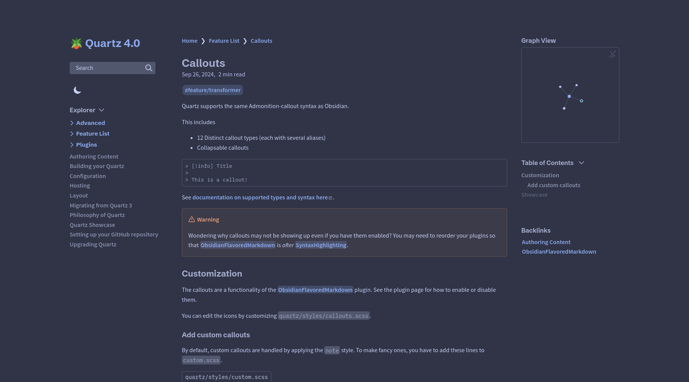

# Quartz Themes

A collection of Obsidian.md themes adapted for [Quartz](https://github.com/jackyzha0/quartz).

> 
>
> Quartz using Catppuccin Frappe theme

## Installation

Clone the project next to your Quartz repository.

```bash
git clone https://github.com/saberzero1/quartz-themes.git
cd quartz-themes
npm ci
```

### Configure Quartz

Add the following line to your `custom.scss` file:

```scss
@use "./themes";
```

Your `custom.scss` should look something like this:

```scss
@use "./base.scss";
@use "./themes";

// put your custom CSS here!
```

### Setting themes and layout

Run the following from the Quartz Themes project root:

```bash
just theme <theme-name>
```

### Updating

Run the following from the Quartz Themes project root to check for updates:

```bash
just check
```

Run the following from the Quartz Themes project root to update the themes:

```bash
just update
```

## Supported Themes

<!--
Colors in GitHub markdown: https://gist.github.com/luigiMinardi/4574708d404cdf4fe0da7ac6fe2314db
-->

> [!NOTE]
> Below list was taken from Obsidian's theme browser, sorted by number of installs. _Last updated: 2024-10-05_.

| Status                                  | Description                                      |
| --------------------------------------- | ------------------------------------------------ |
| $\textcolor{lime}{\textsf{DONE}}$       | Fully supported                                  |
| $\textcolor{yellow}{\textsf{PARTIAL}}$  | Partially supported (see theme page for details) |
| $\textcolor{violet}{\textsf{TESTING}}$  | Testing compatibility                            |
| $\textcolor{brown}{\textsf{BLOCKED}}$   | Waiting for upstream fixes                       |
| $\textcolor{darkgray}{\textsf{TODO}}$   | Not started                                      |
| $\textcolor{red}{\textsf{UNSUPPORTED}}$ | Won't support                                    |
| $\textcolor{red}{\textsf{BROKEN}}$      | Broken or removed from Obsidian                  |

| Obsidian Theme                              | Quartz Status                          |
| ------------------------------------------- | -------------------------------------- |
| [Default](themes/obsidian/README.md)        | $\textcolor{violet}{\textsf{TESTING}}$ |
| Minimal                                     | $\textcolor{violet}{\textsf{TESTING}}$ |
| Things                                      | $\textcolor{violet}{\textsf{TESTING}}$ |
| [Blue Topaz](#)                             | $\textcolor{violet}{\textsf{TESTING}}$ |
| [Obsidian Nord](#)                          | $\textcolor{violet}{\textsf{TESTING}}$ |
| Atom                                        | $\textcolor{violet}{\textsf{TESTING}}$ |
| [AnuPpuccin](#)                             | $\textcolor{violet}{\textsf{TESTING}}$ |
| Obsidianite                                 | $\textcolor{violet}{\textsf{TESTING}}$ |
| Wasp                                        | $\textcolor{violet}{\textsf{TESTING}}$ |
| Shimmering Focus                            | $\textcolor{violet}{\textsf{TESTING}}$ |
| Sanctum                                     | $\textcolor{violet}{\textsf{TESTING}}$ |
| Typewriter                                  | $\textcolor{violet}{\textsf{TESTING}}$ |
| Prism                                       | $\textcolor{violet}{\textsf{TESTING}}$ |
| [Obsidian gruvbox](#)                       | $\textcolor{violet}{\textsf{TESTING}}$ |
| ITS Theme                                   | $\textcolor{violet}{\textsf{TESTING}}$ |
| [Dracula for Obsidian](#)                   | $\textcolor{violet}{\textsf{TESTING}}$ |
| Everforest                                  | $\textcolor{violet}{\textsf{TESTING}}$ |
| [Catppuccin](themes/catppuccin/README.md)   | $\textcolor{violet}{\textsf{TESTING}}$ |
| [80s Neon](#)                               | $\textcolor{violet}{\textsf{TESTING}}$ |
| Cybertron                                   | $\textcolor{violet}{\textsf{TESTING}}$ |
| Primary                                     | $\textcolor{violet}{\textsf{TESTING}}$ |
| [Tokyo Night](themes/tokyo-night/README.md) | $\textcolor{violet}{\textsf{TESTING}}$ |
| Notation                                    | $\textcolor{violet}{\textsf{TESTING}}$ |
| Solarized                                   | $\textcolor{violet}{\textsf{TESTING}}$ |
| Border                                      | $\textcolor{violet}{\textsf{TESTING}}$ |
| Ono Sendai                                  | $\textcolor{violet}{\textsf{TESTING}}$ |
| Typomagical                                 | $\textcolor{violet}{\textsf{TESTING}}$ |
| Obuntu                                      | $\textcolor{violet}{\textsf{TESTING}}$ |
| Terminal                                    | $\textcolor{violet}{\textsf{TESTING}}$ |
| Red Graphite                                | $\textcolor{violet}{\textsf{TESTING}}$ |
| [GitHub Theme](#)                           | $\textcolor{violet}{\textsf{TESTING}}$ |
| [Dracula Official](#)                       | $\textcolor{violet}{\textsf{TESTING}}$ |
| darkgray Topaz                              | $\textcolor{violet}{\textsf{TESTING}}$ |
| Golden Topaz                                | $\textcolor{violet}{\textsf{TESTING}}$ |
| Spectrum                                    | $\textcolor{violet}{\textsf{TESTING}}$ |
| Cyber Glow                                  | $\textcolor{violet}{\textsf{TESTING}}$ |
| Mado Miniflow                               | $\textcolor{violet}{\textsf{TESTING}}$ |
| Encore                                      | $\textcolor{violet}{\textsf{TESTING}}$ |
| LYT Mode                                    | $\textcolor{violet}{\textsf{TESTING}}$ |
| Shiba Inu                                   | $\textcolor{violet}{\textsf{TESTING}}$ |
| PLN                                         | $\textcolor{violet}{\textsf{TESTING}}$ |
| Royal Velvet                                | $\textcolor{violet}{\textsf{TESTING}}$ |
| Ukiyo                                       | $\textcolor{violet}{\textsf{TESTING}}$ |
| Material Gruvbox                            | $\textcolor{violet}{\textsf{TESTING}}$ |
| Dark Moss                                   | $\textcolor{violet}{\textsf{TESTING}}$ |
| Discordian                                  | $\textcolor{violet}{\textsf{TESTING}}$ |
| Ultra Lobster                               | $\textcolor{violet}{\textsf{TESTING}}$ |
| Reverie                                     | $\textcolor{violet}{\textsf{TESTING}}$ |
| obsidian_ia                                 | $\textcolor{violet}{\textsf{TESTING}}$ |
| Sodalite                                    | $\textcolor{violet}{\textsf{TESTING}}$ |
| Mado 11                                     | $\textcolor{violet}{\textsf{TESTING}}$ |
| Obsidianotion                               | $\textcolor{violet}{\textsf{TESTING}}$ |
| Willemstad                                  | $\textcolor{violet}{\textsf{TESTING}}$ |
| Sandstorm                                   | $\textcolor{violet}{\textsf{TESTING}}$ |
| Wyrd                                        | $\textcolor{violet}{\textsf{TESTING}}$ |
| Gitsidian                                   | $\textcolor{violet}{\textsf{TESTING}}$ |
| Moonlight                                   | $\textcolor{violet}{\textsf{TESTING}}$ |
| Typora-Vue                                  | $\textcolor{violet}{\textsf{TESTING}}$ |
| Blackbird                                   | $\textcolor{violet}{\textsf{TESTING}}$ |
| Maple                                       | $\textcolor{violet}{\textsf{TESTING}}$ |
| Notation 2                                  | $\textcolor{violet}{\textsf{TESTING}}$ |
| Light &amp; Bright                          | $\textcolor{violet}{\textsf{TESTING}}$ |
| Ebullientworks                              | $\textcolor{violet}{\textsf{TESTING}}$ |
| Pine Forest Berry                           | $\textcolor{violet}{\textsf{TESTING}}$ |
| WY Console                                  | $\textcolor{violet}{\textsf{TESTING}}$ |
| Aura                                        | $\textcolor{violet}{\textsf{TESTING}}$ |
| Dark Graphite Pie                           | $\textcolor{violet}{\textsf{TESTING}}$ |
| Dracula + LYT                               | $\textcolor{violet}{\textsf{TESTING}}$ |
| Pisum                                       | $\textcolor{violet}{\textsf{TESTING}}$ |
| Comfort color dark                          | $\textcolor{violet}{\textsf{TESTING}}$ |
| 🔔 Chime                                    | $\textcolor{violet}{\textsf{TESTING}}$ |
| Nebula                                      | $\textcolor{violet}{\textsf{TESTING}}$ |
| Flexoki                                     | $\textcolor{violet}{\textsf{TESTING}}$ |
| Dune                                        | $\textcolor{violet}{\textsf{TESTING}}$ |
| Everforest Enchanted                        | $\textcolor{violet}{\textsf{TESTING}}$ |
| Sparkling Wisdom                            | $\textcolor{violet}{\textsf{TESTING}}$ |
| Vanilla AMOLED                              | $\textcolor{violet}{\textsf{TESTING}}$ |
| Material Flat                               | $\textcolor{violet}{\textsf{TESTING}}$ |
| Dawn                                        | $\textcolor{violet}{\textsf{TESTING}}$ |
| Firefly                                     | $\textcolor{violet}{\textsf{TESTING}}$ |
| Suddha                                      | $\textcolor{violet}{\textsf{TESTING}}$ |
| Adwaita                                     | $\textcolor{violet}{\textsf{TESTING}}$ |
| Cardstock                                   | $\textcolor{violet}{\textsf{TESTING}}$ |
| Bolt                                        | $\textcolor{violet}{\textsf{TESTING}}$ |
| Subtlegold                                  | $\textcolor{violet}{\textsf{TESTING}}$ |
| Comfort Smooth                              | $\textcolor{violet}{\textsf{TESTING}}$ |
| Faded                                       | $\textcolor{violet}{\textsf{TESTING}}$ |
| Mammoth                                     | $\textcolor{violet}{\textsf{TESTING}}$ |
| Ursa                                        | $\textcolor{violet}{\textsf{TESTING}}$ |
| Fusion                                      | $\textcolor{violet}{\textsf{TESTING}}$ |
| WiseLight                                   | $\textcolor{violet}{\textsf{TESTING}}$ |
| Vicious                                     | $\textcolor{violet}{\textsf{TESTING}}$ |
| Kanagawa                                    | $\textcolor{violet}{\textsf{TESTING}}$ |
| Simple                                      | $\textcolor{violet}{\textsf{TESTING}}$ |
| Elegance                                    | $\textcolor{violet}{\textsf{TESTING}}$ |
| Aurora                                      | $\textcolor{violet}{\textsf{TESTING}}$ |
| Material Ocean                              | $\textcolor{violet}{\textsf{TESTING}}$ |
| Hipstersmoothie                             | $\textcolor{violet}{\textsf{TESTING}}$ |
| Behave dark                                 | $\textcolor{violet}{\textsf{TESTING}}$ |
| Sparkling Night                             | $\textcolor{violet}{\textsf{TESTING}}$ |
| Purple Aurora                               | $\textcolor{violet}{\textsf{TESTING}}$ |
| Proper Dark                                 | $\textcolor{violet}{\textsf{TESTING}}$ |
| Al Dente                                    | $\textcolor{violet}{\textsf{TESTING}}$ |
| Kakano                                      | $\textcolor{violet}{\textsf{TESTING}}$ |
| Rosé Pine Moon                              | $\textcolor{violet}{\textsf{TESTING}}$ |
| deeper work                                 | $\textcolor{violet}{\textsf{TESTING}}$ |
| iA Writer                                   | $\textcolor{violet}{\textsf{TESTING}}$ |
| Neo                                         | $\textcolor{violet}{\textsf{TESTING}}$ |
| Feather                                     | $\textcolor{violet}{\textsf{TESTING}}$ |
| Theme-That-Shall-Not-Be-Named               | $\textcolor{violet}{\textsf{TESTING}}$ |
| Dayspring                                   | $\textcolor{violet}{\textsf{TESTING}}$ |
| Darkyan                                     | $\textcolor{violet}{\textsf{TESTING}}$ |
| Dracula Gemini                              | $\textcolor{violet}{\textsf{TESTING}}$ |
| Big &amp; Bold                              | $\textcolor{violet}{\textsf{TESTING}}$ |
| Hulk                                        | $\textcolor{violet}{\textsf{TESTING}}$ |
| Listive                                     | $\textcolor{violet}{\textsf{TESTING}}$ |
| Jotter                                      | $\textcolor{violet}{\textsf{TESTING}}$ |
| MagicUser                                   | $\textcolor{violet}{\textsf{TESTING}}$ |
| Autotape                                    | $\textcolor{violet}{\textsf{TESTING}}$ |
| AbsoluteGruv                                | $\textcolor{violet}{\textsf{TESTING}}$ |
| Abyssal                                     | $\textcolor{violet}{\textsf{TESTING}}$ |
| ion                                         | $\textcolor{violet}{\textsf{TESTING}}$ |
| Purple Owl                                  | $\textcolor{violet}{\textsf{TESTING}}$ |
| SALEM                                       | $\textcolor{violet}{\textsf{TESTING}}$ |
| Abecedarium                                 | $\textcolor{violet}{\textsf{TESTING}}$ |
| Obsidian Boom                               | $\textcolor{violet}{\textsf{TESTING}}$ |
| Simplicity                                  | $\textcolor{violet}{\textsf{TESTING}}$ |
| Olivier’s Theme                             | $\textcolor{violet}{\textsf{TESTING}}$ |
| Violet Evening                              | $\textcolor{violet}{\textsf{TESTING}}$ |
| Dracula Slim                                | $\textcolor{violet}{\textsf{TESTING}}$ |
| Christmas                                   | $\textcolor{violet}{\textsf{TESTING}}$ |
| Ayu Mirage                                  | $\textcolor{violet}{\textsf{TESTING}}$ |
| Vauxhall                                    | $\textcolor{violet}{\textsf{TESTING}}$ |
| Apatheia                                    | $\textcolor{violet}{\textsf{TESTING}}$ |
| Everblush                                   | $\textcolor{violet}{\textsf{TESTING}}$ |
| Buena Vista                                 | $\textcolor{violet}{\textsf{TESTING}}$ |
| iB Writer                                   | $\textcolor{violet}{\textsf{TESTING}}$ |
| Dark Graphite                               | $\textcolor{violet}{\textsf{TESTING}}$ |
| Zenburn                                     | $\textcolor{violet}{\textsf{TESTING}}$ |
| Brutalism                                   | $\textcolor{violet}{\textsf{TESTING}}$ |
| GDCT                                        | $\textcolor{violet}{\textsf{TESTING}}$ |
| monochroYOU                                 | $\textcolor{violet}{\textsf{TESTING}}$ |
| Micro Mike                                  | $\textcolor{violet}{\textsf{TESTING}}$ |
| Panic Mode                                  | $\textcolor{violet}{\textsf{TESTING}}$ |
| Creature                                    | $\textcolor{violet}{\textsf{TESTING}}$ |
| Charcoal                                    | $\textcolor{violet}{\textsf{TESTING}}$ |
| Apex                                        | $\textcolor{violet}{\textsf{TESTING}}$ |
| halcyon                                     | $\textcolor{violet}{\textsf{TESTING}}$ |
| Tom's Theme                                 | $\textcolor{violet}{\textsf{TESTING}}$ |
| Base2Tone                                   | $\textcolor{violet}{\textsf{TESTING}}$ |
| ProtocolBlue                                | $\textcolor{violet}{\textsf{TESTING}}$ |
| Dekurai                                     | $\textcolor{violet}{\textsf{TESTING}}$ |
| Qlean                                       | $\textcolor{violet}{\textsf{TESTING}}$ |
| Monokai                                     | $\textcolor{violet}{\textsf{TESTING}}$ |
| Garden Gnome (Adwaita, GTK)                 | $\textcolor{violet}{\textsf{TESTING}}$ |
| NeuBorder                                   | $\textcolor{violet}{\textsf{TESTING}}$ |
| GitHubDHC                                   | $\textcolor{violet}{\textsf{TESTING}}$ |
| Polka                                       | $\textcolor{violet}{\textsf{TESTING}}$ |
| Yue                                         | $\textcolor{violet}{\textsf{TESTING}}$ |
| Comfort                                     | $\textcolor{violet}{\textsf{TESTING}}$ |
| Rmaki                                       | $\textcolor{violet}{\textsf{TESTING}}$ |
| Heboric                                     | $\textcolor{violet}{\textsf{TESTING}}$ |
| NotSwift                                    | $\textcolor{violet}{\textsf{TESTING}}$ |
| Nightfox                                    | $\textcolor{violet}{\textsf{TESTING}}$ |
| sQdthOne                                    | $\textcolor{violet}{\textsf{TESTING}}$ |
| Nordic                                      | $\textcolor{violet}{\textsf{TESTING}}$ |
| SynthWave                                   | $\textcolor{violet}{\textsf{TESTING}}$ |
| Cybertron Shifted                           | $\textcolor{violet}{\textsf{TESTING}}$ |
| Iceberg                                     | $\textcolor{violet}{\textsf{TESTING}}$ |
| LaTeX                                       | $\textcolor{violet}{\textsf{TESTING}}$ |
| WilcoxOne                                   | $\textcolor{violet}{\textsf{TESTING}}$ |
| Tokyo Night Storm                           | $\textcolor{violet}{\textsf{TESTING}}$ |
| Dracula Plus                                | $\textcolor{violet}{\textsf{TESTING}}$ |
| Rosé Pine                                   | $\textcolor{violet}{\textsf{TESTING}}$ |
| Lemons Theme                                | $\textcolor{violet}{\textsf{TESTING}}$ |
| Novadust                                    | $\textcolor{violet}{\textsf{TESTING}}$ |
| Wombat                                      | $\textcolor{violet}{\textsf{TESTING}}$ |
| Origin                                      | $\textcolor{violet}{\textsf{TESTING}}$ |
| GDCT Dark                                   | $\textcolor{violet}{\textsf{TESTING}}$ |
| Synthwave '84                               | $\textcolor{violet}{\textsf{TESTING}}$ |
| Neovim                                      | $\textcolor{violet}{\textsf{TESTING}}$ |
| Solitude                                    | $\textcolor{violet}{\textsf{TESTING}}$ |
| Phoenix                                     | $\textcolor{violet}{\textsf{TESTING}}$ |
| Comfort Dark                                | $\textcolor{violet}{\textsf{TESTING}}$ |
| Aura Dark                                   | $\textcolor{violet}{\textsf{TESTING}}$ |
| Prime                                       | $\textcolor{violet}{\textsf{TESTING}}$ |
| W95                                         | $\textcolor{violet}{\textsf{TESTING}}$ |
| Carbon                                      | $\textcolor{violet}{\textsf{TESTING}}$ |
| Pure                                        | $\textcolor{violet}{\textsf{TESTING}}$ |
| Tiniri                                      | $\textcolor{violet}{\textsf{TESTING}}$ |
| RetroNotes                                  | $\textcolor{violet}{\textsf{TESTING}}$ |
| Atomus                                      | $\textcolor{violet}{\textsf{TESTING}}$ |
| Sanctum reborn                              | $\textcolor{violet}{\textsf{TESTING}}$ |
| Rezin                                       | $\textcolor{violet}{\textsf{TESTING}}$ |
| Soloing                                     | $\textcolor{violet}{\textsf{TESTING}}$ |
| Tomorrow Night Bright                       | $\textcolor{violet}{\textsf{TESTING}}$ |
| Underwater                                  | $\textcolor{violet}{\textsf{TESTING}}$ |
| Celestial Night                             | $\textcolor{violet}{\textsf{TESTING}}$ |
| Nightingale                                 | $\textcolor{violet}{\textsf{TESTING}}$ |
| Sanguine                                    | $\textcolor{violet}{\textsf{TESTING}}$ |
| Zario                                       | $\textcolor{violet}{\textsf{TESTING}}$ |
| Brainhack                                   | $\textcolor{violet}{\textsf{TESTING}}$ |
| Pale - 淡                                   | $\textcolor{violet}{\textsf{TESTING}}$ |
| Reshi                                       | $\textcolor{violet}{\textsf{TESTING}}$ |
| Spring                                      | $\textcolor{violet}{\textsf{TESTING}}$ |
| Transient                                   | $\textcolor{violet}{\textsf{TESTING}}$ |
| Arcane                                      | $\textcolor{violet}{\textsf{TESTING}}$ |
| Shade Sanctuary                             | $\textcolor{violet}{\textsf{TESTING}}$ |
| Green Nightmare                             | $\textcolor{violet}{\textsf{TESTING}}$ |
| Dunite                                      | $\textcolor{violet}{\textsf{TESTING}}$ |
| Oldsidian Purple                            | $\textcolor{violet}{\textsf{TESTING}}$ |
| Vibrant                                     | $\textcolor{violet}{\textsf{TESTING}}$ |
| Vanilla Palettes                            | $\textcolor{violet}{\textsf{TESTING}}$ |
| Soothe                                      | $\textcolor{violet}{\textsf{TESTING}}$ |
| Minimal-Resources                           | $\textcolor{violet}{\textsf{TESTING}}$ |
| Sparkling Day                               | $\textcolor{violet}{\textsf{TESTING}}$ |
| Sandover                                    | $\textcolor{violet}{\textsf{TESTING}}$ |
| Ayu Light &amp; Mirage                      | $\textcolor{violet}{\textsf{TESTING}}$ |
| Ethereon                                    | $\textcolor{violet}{\textsf{TESTING}}$ |
| Penumbra                                    | $\textcolor{violet}{\textsf{TESTING}}$ |
| Serika                                      | $\textcolor{violet}{\textsf{TESTING}}$ |
| Covert                                      | $\textcolor{violet}{\textsf{TESTING}}$ |
| Focus                                       | $\textcolor{violet}{\textsf{TESTING}}$ |
| Nier                                        | $\textcolor{violet}{\textsf{TESTING}}$ |
| Allium                                      | $\textcolor{violet}{\textsf{TESTING}}$ |
| EvilRed                                     | $\textcolor{violet}{\textsf{TESTING}}$ |
| Venom                                       | $\textcolor{violet}{\textsf{TESTING}}$ |
| Sea Glass                                   | $\textcolor{violet}{\textsf{TESTING}}$ |
| Poimandres                                  | $\textcolor{violet}{\textsf{TESTING}}$ |
| mono black (monochrome, charcoal)           | $\textcolor{violet}{\textsf{TESTING}}$ |
| Lumines                                     | $\textcolor{violet}{\textsf{TESTING}}$ |
| Creme brulee                                | $\textcolor{violet}{\textsf{TESTING}}$ |
| Oozy                                        | $\textcolor{violet}{\textsf{TESTING}}$ |
| Strict                                      | $\textcolor{violet}{\textsf{TESTING}}$ |
| Improved Potato                             | $\textcolor{violet}{\textsf{TESTING}}$ |
| Agate                                       | $\textcolor{violet}{\textsf{TESTING}}$ |
| DarkEmber                                   | $\textcolor{violet}{\textsf{TESTING}}$ |
| Perso                                       | $\textcolor{violet}{\textsf{TESTING}}$ |
| MistyMauve                                  | $\textcolor{violet}{\textsf{TESTING}}$ |
| Virgo                                       | $\textcolor{violet}{\textsf{TESTING}}$ |
| Prussian Blue                               | $\textcolor{violet}{\textsf{TESTING}}$ |
| Oreo                                        | $\textcolor{violet}{\textsf{TESTING}}$ |
| Colored Candy                               | $\textcolor{violet}{\textsf{TESTING}}$ |
| Space                                       | $\textcolor{violet}{\textsf{TESTING}}$ |
| Dark Clarity                                | $\textcolor{violet}{\textsf{TESTING}}$ |
| chiaroscuroflow                             | $\textcolor{violet}{\textsf{TESTING}}$ |
| Seamless View                               | $\textcolor{violet}{\textsf{TESTING}}$ |
| OISTNB                                      | $\textcolor{violet}{\textsf{TESTING}}$ |
| Vanilla AMOLED Color                        | $\textcolor{violet}{\textsf{TESTING}}$ |
| Dynamic Color                               | $\textcolor{violet}{\textsf{TESTING}}$ |
| Aurora-Twilight                             | $\textcolor{violet}{\textsf{TESTING}}$ |
| Tomorrow                                    | $\textcolor{violet}{\textsf{TESTING}}$ |
| DarkNebula                                  | $\textcolor{violet}{\textsf{TESTING}}$ |
| Gummy-Revived                               | $\textcolor{violet}{\textsf{TESTING}}$ |
| Lorens                                      | $\textcolor{violet}{\textsf{TESTING}}$ |
| Adrenaline                                  | $\textcolor{violet}{\textsf{TESTING}}$ |
| Minimal Edge                                | $\textcolor{violet}{\textsf{TESTING}}$ |
| Dark Castle                                 | $\textcolor{violet}{\textsf{TESTING}}$ |
| Neon Synthwave                              | $\textcolor{violet}{\textsf{TESTING}}$ |
| Pxld                                        | $\textcolor{violet}{\textsf{TESTING}}$ |
| Kiwi Mono                                   | $\textcolor{violet}{\textsf{TESTING}}$ |
| Midnight                                    | $\textcolor{violet}{\textsf{TESTING}}$ |
| Eldritch                                    | $\textcolor{violet}{\textsf{TESTING}}$ |
| Rift                                        | $\textcolor{violet}{\textsf{TESTING}}$ |
| Blossom                                     | $\textcolor{violet}{\textsf{TESTING}}$ |
| Kurokula                                    | $\textcolor{violet}{\textsf{TESTING}}$ |
| Abate                                       | $\textcolor{violet}{\textsf{TESTING}}$ |
| Muted-Blue                                  | $\textcolor{violet}{\textsf{TESTING}}$ |
| Cobalt Peacock                              | $\textcolor{violet}{\textsf{TESTING}}$ |
| Mint-Breeze                                 | $\textcolor{violet}{\textsf{TESTING}}$ |
| Lavender-Mist                               | $\textcolor{violet}{\textsf{TESTING}}$ |
| Spectrum Blue                               | $\textcolor{violet}{\textsf{TESTING}}$ |
| Northern-Sky                                | $\textcolor{violet}{\textsf{TESTING}}$ |
| Evergreen-Shadow                            | $\textcolor{violet}{\textsf{TESTING}}$ |
| Trace Labs                                  | $\textcolor{violet}{\textsf{TESTING}}$ |
| Bossidian                                   | $\textcolor{violet}{\textsf{TESTING}}$ |
| Black                                       | $\textcolor{violet}{\textsf{TESTING}}$ |
| nobb                                        | $\textcolor{violet}{\textsf{TESTING}}$ |
| Velvet-Moon                                 | $\textcolor{violet}{\textsf{TESTING}}$ |
| Midnight-Fjord                              | $\textcolor{violet}{\textsf{TESTING}}$ |
| Refined Default                             | $\textcolor{violet}{\textsf{TESTING}}$ |
| Rose Red                                    | $\textcolor{violet}{\textsf{TESTING}}$ |

<!--
## Specification

WIP
-->
