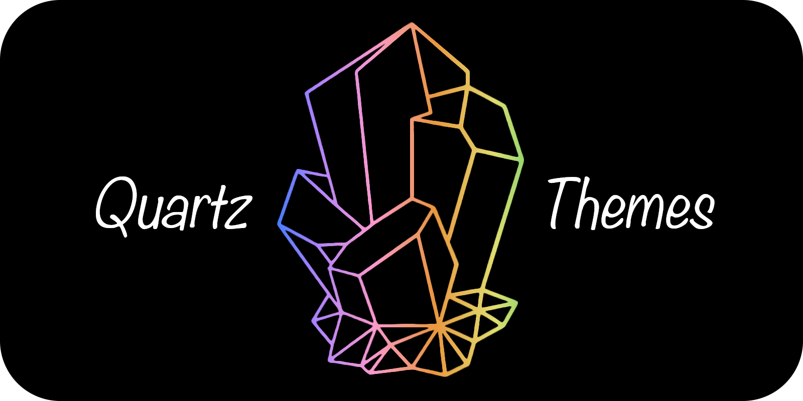

# Quartz Themes

A collection of [Obsidian](https://obsidian.md/) themes adapted for [Quartz](https://github.com/jackyzha0/quartz).

<p align="center" width="100%">
  
</p>

&color=444>)
&color=444>)

## Table of Contents

- [Quartz Themes](#quartz-themes)
  - [Table of Contents](#table-of-contents)
  - [Installation](#installation)
    - [GitHub Actions (Recommended)](#github-actions-recommended)
    - [Automatic install into Quartz repository](#automatic-install-into-quartz-repository)
    - [Manual install](#manual-install)
    - [Quartz Syncer](#quartz-syncer)
  - [Supported Themes](#supported-themes)
  - [Licenses](#licenses)

## Installation

### GitHub Actions (Recommended)

Add the following lines to your `deploy.yml` before the `permissions` section:

```yaml
env:
  THEME_NAME: <THEME-NAME>
```

And add the following lines to your `deploy.yml` before the `build` step:

```yaml
- name: Fetch Quartz Theme
  run: curl -s -S https://raw.githubusercontent.com/saberzero1/quartz-themes/master/action.sh | bash -s -- $THEME_NAME
```

> [!IMPORTANT]
> Replace `<THEME-NAME>` with your desired theme name. See [Compatibility List](#supported-themes)

> [!TIP]
> Example for Tokyo Night:
>
> ```yaml
> env:
>   THEME_NAME: tokyo-night
> ```

The full script would look like this:

```yaml
name: Deploy Quartz site to GitHub Pages

on:
  push:
    branches:
      - v4

env:
  THEME_NAME: <THEME-NAME>

permissions:
  contents: read
  pages: write
  id-token: write

concurrency:
  group: "pages"
  cancel-in-progress: false

jobs:
  build:
    runs-on: ubuntu-22.04
    steps:
      - uses: actions/checkout@v4
        with:
          fetch-depth: 0 # Fetch all history for git info
      - uses: actions/setup-node@v4
        with:
          node-version: 22
      - name: Install Dependencies
        run: npm ci
      - name: Fetch Quartz Theme
        run: curl -s -S https://raw.githubusercontent.com/saberzero1/quartz-themes/master/action.sh | bash -s -- $THEME_NAME
      - name: Build Quartz
        run: npx quartz build
      - name: Upload artifact
        uses: actions/upload-pages-artifact@v3
        with:
          path: public

  deploy:
    needs: build
    environment:
      name: github-pages
      url: ${{ steps.deployment.outputs.page_url }}
    runs-on: ubuntu-latest
    steps:
      - name: Deploy to GitHub Pages
        id: deployment
        uses: actions/deploy-pages@v4
```

### Automatic install into Quartz repository

> [!TIP]
> This installation method is recommended for users who want to install themes into their Quartz repository directly. This method is also recommended for user who cannot fetch dependencies during compilation.

Download the latest version of the [action.sh](https://raw.githubusercontent.com/saberzero1/quartz-themes/master/action.sh) script or run the following to download it:

```bash
curl -s -S -o action.sh https://raw.githubusercontent.com/saberzero1/quartz-themes/master/action.sh
```

> [!NOTE]
> Windows users should use `action.bat` instead, unless they also access to the bash shell (git-bash, etc.) or WSL.
>
> ```bash
> curl -s -S -o action.bat https://raw.githubusercontent.com/saberzero1/quartz-themes/master/action.bat
>
> action.bat tokyo-night
> ```

Then run the `action.sh` script with the desired theme to install it into your Quartz repository:

```bash
# Example: installing Tokyo Night...
./action.sh tokyo-night

# ...should output:
# Quartz root succesfully detected...
# Input theme: tokyo-night
# Parsing input theme...
# Theme tokyo-night parsed to tokyo-night
# Validating theme...
# Cleaning theme directory...
# Creating theme directory...
# Fetching theme files...
# Installing theme files...
# Applying patches...
# Verifying setup...
# Added import line to custom.scss...
# Finished fetching and applying theme 'tokyo-night'.
```

### Manual install

Manually download the `_index.scss` file from the [themes directory of your choice](./themes/) in this repository, and place it in your Quartz repository's at `quartz/styles/themes/_index.scss`. (Create the `themes` directory if it doesn't exist.)

Then, add the following line to your `src/styles/custom.scss` file **after** the `@use "base";` line:

```scss
@use "themes";
```

> [!IMPORTANT]
> For dark-only or light-only themes, remember to remove `Component.Darkmode()` from your `quartz.config.ts` file.

### Quartz Syncer

> [!IMPORTANT]
> This setup method is not yet available. It is currently being tested and will be released in the future.

## Supported Themes

<details>
  <summary>
    Glossary
  </summary>

| Status                                               | Description                                                                                                                                                        |
| ---------------------------------------------------- | ------------------------------------------------------------------------------------------------------------------------------------------------------------------ |
|                | Fully supported                                                                                                                                                    |
|          | Partially supported (see theme page for details)                                                                                                                   |
|    | This theme contains information for the [Style Settings plugin](https://github.com/mgmeyers/obsidian-style-settings). See the table for the configured sub-themes. |
|        | Testing compatibility                                                                                                                                              |
|          | Waiting for upstream fixes                                                                                                                                         |
|                | Not started                                                                                                                                                        |
|  | Won't support                                                                                                                                                      |
|           | Broken or removed from Obsidian                                                                                                                                    |

| Theme Modes                              | Description               |
| ---------------------------------------- | ------------------------- |
|    | Both dark and light theme |
|  | Light theme only          |
|    | Dark theme only           |

</details>

| Supported Modes                          | Obsidian Theme Name              | Theme Compatibility Status                                                                        | Live Preview                                                                          | Theme License                                                                                                                              |
| ---------------------------------------- | -------------------------------- | ------------------------------------------------------------------------------------------------- | ------------------------------------------------------------------------------------- | ------------------------------------------------------------------------------------------------------------------------------------------ |
|    | `80s-neon`                       |                                                             | [live preview](https://quartz-themes.github.io/80s-neon/syntax)                       | <a href="obsidian/80s Neon/LICENSE.md"><svg src="media/license/unlicense.svg" alt="UNLICENSE"/></a>                                        |
|  | `abate`                          |                                                       | [live preview](https://quartz-themes.github.io/abate/syntax)                          | <a href="obsidian/Abate/LICENSE.md"><svg src="media/license/mit.svg" alt="MIT"/></a>                                                       |
|    | `abecedarium`                    |                                                             | [live preview](https://quartz-themes.github.io/abecedarium/syntax)                    | <a href="obsidian/Abecedarium/LICENSE.md"><svg src="media/license/mit.svg" alt="MIT"/></a>                                                 |
|    | `absolutegruv`                   |     | [live preview](https://quartz-themes.github.io/absolutegruv/syntax)                   | <a href="obsidian/AbsoluteGruv/LICENSE.md"><svg src="media/license/mit.svg" alt="MIT"/></a>                                                |
|    | `abyssal`                        |     | [live preview](https://quartz-themes.github.io/abyssal/syntax)                        | <a href="obsidian/Abyssal/LICENSE.md"><svg src="media/license/mit.svg" alt="MIT"/></a>                                                     |
|    | `adrenaline`                     |                                                             | [live preview](https://quartz-themes.github.io/adrenaline/syntax)                     | <a href="obsidian/Adrenaline/LICENSE.md"><svg src="media/license/mit.svg" alt="MIT"/></a>                                                  |
|    | `adwaita`                        |     | [live preview](https://quartz-themes.github.io/adwaita/syntax)                        | <a href="obsidian/Adwaita/LICENSE.md"><svg src="media/license/mit.svg" alt="MIT"/></a>                                                     |
|  | `agate`                          |                                                             | [live preview](https://quartz-themes.github.io/agate/syntax)                          | <a href="obsidian/Agate/LICENSE.md"><svg src="media/license/mit.svg" alt="MIT"/></a>                                                       |
|    | `aged-whisky`                    |                                                     | [live preview](https://quartz-themes.github.io/aged-whisky/syntax)                    | <a href="obsidian/aged whisky/LICENSE.md"><svg src="media/license/mit.svg" alt="MIT"/></a>                                                 |
|  | `al-dente`                       |                                                     | [live preview](https://quartz-themes.github.io/al-dente/syntax)                       | <a href="obsidian/Al Dente/LICENSE.md"><svg src="media/license/cc0-1.0.svg" alt="CC0-1.0"/></a>                                            |
|    | `allium`                         |   | [live preview](https://quartz-themes.github.io/allium/syntax)                         | <a href="obsidian/Allium/LICENSE.md"><svg src="media/license/mit.svg" alt="MIT"/></a>                                                      |
|    | `amoled-serenity`                |   | [live preview](https://quartz-themes.github.io/amoled-serenity/syntax)                | <a href="obsidian/AMOLED Serenity/LICENSE.md"><svg src="media/license/mit.svg" alt="MIT"/></a>                                             |
|    | `anuppuccin`                     |   | [live preview](https://quartz-themes.github.io/anuppuccin/syntax)                     | <a href="obsidian/AnuPpuccin/LICENSE.md"><svg src="media/license/gpl-3.0.svg" alt="GPL-3.0"/></a>                                          |
|    | `apatheia`                       |   | [live preview](https://quartz-themes.github.io/apatheia/syntax)                       | <a href="obsidian/Apatheia/LICENSE.md"><svg src="media/license/mit.svg" alt="MIT"/></a>                                                    |
|    | `apex`                           |                                                     | [live preview](https://quartz-themes.github.io/apex/syntax)                           | <a href="obsidian/Apex/LICENSE.md"><svg src="media/license/mit.svg" alt="MIT"/></a>                                                        |
|    | `arcane`                         |                                                     | [live preview](https://quartz-themes.github.io/arcane/syntax)                         | <a href="obsidian/Arcane/LICENSE.md"><svg src="media/license/mit.svg" alt="MIT"/></a>                                                      |
|    | `atom`                           |                                                     | [live preview](https://quartz-themes.github.io/atom/syntax)                           | <a href="obsidian/Atom/LICENSE.md"><svg src="media/license/unlicense.svg" alt="UNLICENSE"/></a>                                            |
|    | `atomus`                         |                                                     | [live preview](https://quartz-themes.github.io/atomus/syntax)                         | <a href="obsidian/Atomus/LICENSE.md"><svg src="media/license/unlicense.svg" alt="UNLICENSE"/></a>                                          |
|    | `aura`                           |           | [live preview](https://quartz-themes.github.io/aura/syntax)                           | <a href="obsidian/Aura/LICENSE.md"><svg src="media/license/gpl-2.0.svg" alt="GPL-2.0"/></a>                                                |
|    | `aura-dark`                      |   | [live preview](https://quartz-themes.github.io/aura-dark/syntax)                      | <a href="obsidian/Aura Dark/LICENSE.md"><svg src="media/license/mit.svg" alt="MIT"/></a>                                                   |
|    | `aurora`                         |                                                     | [live preview](https://quartz-themes.github.io/aurora/syntax)                         | <a href="obsidian/Aurora/LICENSE.md"><svg src="media/license/mit.svg" alt="MIT"/></a>                                                      |
|    | `aurora-twilight`                |                                                     | [live preview](https://quartz-themes.github.io/aurora-twilight/syntax)                | <a href="obsidian/Aurora-Twilight/LICENSE.md"><svg src="media/license/mit.svg" alt="MIT"/></a>                                             |
|    | `autotape`                       |                                                     | [live preview](https://quartz-themes.github.io/autotape/syntax)                       | <a href="obsidian/Autotape/LICENSE.md"><svg src="media/license/unlicense.svg" alt="UNLICENSE"/></a>                                        |
|    | `ayu-light-mirage`               |                                                     | [live preview](https://quartz-themes.github.io/ayu-light-mirage/syntax)               | <a href="obsidian/Ayu Light & Mirage/LICENSE.md"><svg src="media/license/no spdx id found.svg" alt="NO SPDX ID FOUND"/></a>                |
|    | `ayu-mirage`                     |                                                     | [live preview](https://quartz-themes.github.io/ayu-mirage/syntax)                     | <a href="obsidian/Ayu Mirage/LICENSE.md"><svg src="media/license/no spdx id found.svg" alt="NO SPDX ID FOUND"/></a>                        |
|    | `base2tone`                      |                                                     | [live preview](https://quartz-themes.github.io/base2tone/syntax)                      | <a href="obsidian/Base2Tone/LICENSE.md"><svg src="media/license/unlicense.svg" alt="UNLICENSE"/></a>                                       |
|    | `behave-dark`                    |                                                     | [live preview](https://quartz-themes.github.io/behave-dark/syntax)                    | <a href="obsidian/Behave dark/LICENSE.md"><svg src="media/license/mit.svg" alt="MIT"/></a>                                                 |
|    | `big-bold`                       |   | [live preview](https://quartz-themes.github.io/big-bold/syntax)                       | <a href="obsidian/Big & Bold/LICENSE.md"><svg src="media/license/cc0-1.0.svg" alt="CC0-1.0"/></a>                                          |
|    | `black`                          |                                                     | [live preview](https://quartz-themes.github.io/black/syntax)                          | <a href="obsidian/Black/LICENSE.md"><svg src="media/license/mit.svg" alt="MIT"/></a>                                                       |
|    | `blackbird`                      |                                                     | [live preview](https://quartz-themes.github.io/blackbird/syntax)                      | <a href="obsidian/Blackbird/LICENSE.md"><svg src="media/license/mit.svg" alt="MIT"/></a>                                                   |
|    | `blossom`                        |                                                     | [live preview](https://quartz-themes.github.io/blossom/syntax)                        | <a href="obsidian/Blossom/LICENSE.md"><svg src="media/license/mit.svg" alt="MIT"/></a>                                                     |
|    | `blue-topaz`                     |   | [live preview](https://quartz-themes.github.io/blue-topaz/syntax)                     | <a href="obsidian/Blue Topaz/LICENSE.md"><svg src="media/license/mit.svg" alt="MIT"/></a>                                                  |
|    | `bolt`                           |   | [live preview](https://quartz-themes.github.io/bolt/syntax)                           | <a href="obsidian/Bolt/LICENSE.md"><svg src="media/license/unlicense.svg" alt="UNLICENSE"/></a>                                            |
|    | `border`                         |   | [live preview](https://quartz-themes.github.io/border/syntax)                         | <a href="obsidian/Border/LICENSE.md"><svg src="media/license/mit.svg" alt="MIT"/></a>                                                      |
|    | `borealis`                       |   | [live preview](https://quartz-themes.github.io/borealis/syntax)                       | <a href="obsidian/Borealis/LICENSE.md"><svg src="media/license/mit.svg" alt="MIT"/></a>                                                    |
|    | `bossidian`                      |                                                     | [live preview](https://quartz-themes.github.io/bossidian/syntax)                      | <a href="obsidian/Bossidian/LICENSE.md"><svg src="media/license/mit.svg" alt="MIT"/></a>                                                   |
|    | `brainhack`                      |   | [live preview](https://quartz-themes.github.io/brainhack/syntax)                      | <a href="obsidian/Brainhack/LICENSE.md"><svg src="media/license/mit.svg" alt="MIT"/></a>                                                   |
|    | `brutalism`                      |                                                     | [live preview](https://quartz-themes.github.io/brutalism/syntax)                      | <a href="obsidian/Brutalism/LICENSE.md"><svg src="media/license/mit.svg" alt="MIT"/></a>                                                   |
|    | `buena-vista`                    |   | [live preview](https://quartz-themes.github.io/buena-vista/syntax)                    | <a href="obsidian/Buena Vista/LICENSE.md"><svg src="media/license/gpl-3.0.svg" alt="GPL-3.0"/></a>                                         |
|    | `camena`                         |                                                     | [live preview](https://quartz-themes.github.io/camena/syntax)                         | <a href="obsidian/Camena/LICENSE.md"><svg src="media/license/mit.svg" alt="MIT"/></a>                                                      |
|    | `carbon`                         |                                                     | [live preview](https://quartz-themes.github.io/carbon/syntax)                         | <a href="obsidian/Carbon/LICENSE.md"><svg src="media/license/gpl-3.0.svg" alt="GPL-3.0"/></a>                                              |
|    | `cardstock`                      |                                                     | [live preview](https://quartz-themes.github.io/cardstock/syntax)                      | <a href="obsidian/Cardstock/LICENSE.md"><svg src="media/license/mit.svg" alt="MIT"/></a>                                                   |
|    | `catppuccin`                     |   | [live preview](https://quartz-themes.github.io/catppuccin/syntax)                     | <a href="obsidian/Catppuccin/LICENSE.md"><svg src="media/license/mit.svg" alt="MIT"/></a>                                                  |
|    | `celestial-night`                |   | [live preview](https://quartz-themes.github.io/celestial-night/syntax)                | <a href="obsidian/Celestial Night/LICENSE.md"><svg src="media/license/unlicense.svg" alt="UNLICENSE"/></a>                                 |
|    | `charcoal`                       |                                                     | [live preview](https://quartz-themes.github.io/charcoal/syntax)                       | <a href="obsidian/Charcoal/LICENSE.md"><svg src="media/license/no spdx id found.svg" alt="NO SPDX ID FOUND"/></a>                          |
|    | `chiaroscuroflow`                |   | [live preview](https://quartz-themes.github.io/chiaroscuroflow/syntax)                | <a href="obsidian/chiaroscuroflow/LICENSE.md"><svg src="media/license/mit.svg" alt="MIT"/></a>                                             |
|    | `chime`                          |   | [live preview](https://quartz-themes.github.io/chime/syntax)                          | <a href="obsidian/Chime/LICENSE.md"><svg src="media/license/mit.svg" alt="MIT"/></a>                                                       |
|    | `christmas`                      |                                                     | [live preview](https://quartz-themes.github.io/christmas/syntax)                      | <a href="obsidian/Christmas/LICENSE.md"><svg src="media/license/no spdx id found.svg" alt="NO SPDX ID FOUND"/></a>                         |
|    | `cobalt-peacock`                 |                                                     | [live preview](https://quartz-themes.github.io/cobalt-peacock/syntax)                 | <a href="obsidian/Cobalt Peacock/LICENSE.md"><svg src="media/license/mit.svg" alt="MIT"/></a>                                              |
|    | `cocoa`                          |                                                     | [live preview](https://quartz-themes.github.io/cocoa/syntax)                          | <a href="obsidian/cocoa/LICENSE.md"><svg src="media/license/mit.svg" alt="MIT"/></a>                                                       |
|    | `colored-candy`                  |   | [live preview](https://quartz-themes.github.io/colored-candy/syntax)                  | <a href="obsidian/Colored Candy/LICENSE.md"><svg src="media/license/mit.svg" alt="MIT"/></a>                                               |
|  | `comfort`                        |     | [live preview](https://quartz-themes.github.io/comfort/syntax)                        | <a href="obsidian/Comfort/LICENSE.md"><svg src="media/license/unlicense.svg" alt="UNLICENSE"/></a>                                         |
|    | `comfort-color-dark`             |                                                     | [live preview](https://quartz-themes.github.io/comfort-color-dark/syntax)             | <a href="obsidian/Comfort color dark/LICENSE.md"><svg src="media/license/no spdx id found.svg" alt="NO SPDX ID FOUND"/></a>                |
|    | `comfort-dark`                   |                                                     | [live preview](https://quartz-themes.github.io/comfort-dark/syntax)                   | <a href="obsidian/Comfort Dark/LICENSE.md"><svg src="media/license/mit.svg" alt="MIT"/></a>                                                |
|    | `comfort-smooth`                 |                                                     | [live preview](https://quartz-themes.github.io/comfort-smooth/syntax)                 | <a href="obsidian/Comfort Smooth/LICENSE.md"><svg src="media/license/no spdx id found.svg" alt="NO SPDX ID FOUND"/></a>                    |
|    | `composer`                       |   | [live preview](https://quartz-themes.github.io/composer/syntax)                       | <a href="obsidian/Composer/LICENSE.md"><svg src="media/license/mit.svg" alt="MIT"/></a>                                                    |
|    | `consolas`                       |                                                     | [live preview](https://quartz-themes.github.io/consolas/syntax)                       | <a href="obsidian/Consolas/LICENSE.md"><svg src="media/license/apache-2.0.svg" alt="APACHE-2.0"/></a>                                      |
|    | `covert`                         |                                                     | [live preview](https://quartz-themes.github.io/covert/syntax)                         | <a href="obsidian/Covert/LICENSE.md"><svg src="media/license/mit.svg" alt="MIT"/></a>                                                      |
|    | `creature`                       |                                                     | [live preview](https://quartz-themes.github.io/creature/syntax)                       | <a href="obsidian/Creature/LICENSE.md"><svg src="media/license/no spdx id found.svg" alt="NO SPDX ID FOUND"/></a>                          |
|    | `creme-brulee`                   |                                                     | [live preview](https://quartz-themes.github.io/creme-brulee/syntax)                   | <a href="obsidian/Creme brulee/LICENSE.md"><svg src="media/license/mit.svg" alt="MIT"/></a>                                                |
|    | `cupertino`                      |   | [live preview](https://quartz-themes.github.io/cupertino/syntax)                      | <a href="obsidian/Cupertino/LICENSE.md"><svg src="media/license/mit.svg" alt="MIT"/></a>                                                   |
|    | `cyber-glow`                     |   | [live preview](https://quartz-themes.github.io/cyber-glow/syntax)                     | <a href="obsidian/Cyber Glow/LICENSE.md"><svg src="media/license/mit.svg" alt="MIT"/></a>                                                  |
|    | `cybertron`                      |                                                     | [live preview](https://quartz-themes.github.io/cybertron/syntax)                      | <a href="obsidian/Cybertron/LICENSE.md"><svg src="media/license/no spdx id found.svg" alt="NO SPDX ID FOUND"/></a>                         |
|    | `cybertron-shifted`              |                                                     | [live preview](https://quartz-themes.github.io/cybertron-shifted/syntax)              | <a href="obsidian/Cybertron Shifted/LICENSE.md"><svg src="media/license/mit.svg" alt="MIT"/></a>                                           |
|    | `dark-castle`                    |                                                     | [live preview](https://quartz-themes.github.io/dark-castle/syntax)                    | <a href="obsidian/Dark Castle/LICENSE.md"><svg src="media/license/mit.svg" alt="MIT"/></a>                                                 |
|    | `dark-clarity`                   |   | [live preview](https://quartz-themes.github.io/dark-clarity/syntax)                   | <a href="obsidian/Dark Clarity/LICENSE.md"><svg src="media/license/mit.svg" alt="MIT"/></a>                                                |
|    | `dark-graphite`                  |                                                     | [live preview](https://quartz-themes.github.io/dark-graphite/syntax)                  | <a href="obsidian/Dark Graphite/LICENSE.md"><svg src="media/license/no spdx id found.svg" alt="NO SPDX ID FOUND"/></a>                     |
|    | `dark-graphite-pie`              |                                                     | [live preview](https://quartz-themes.github.io/dark-graphite-pie/syntax)              | <a href="obsidian/Dark Graphite Pie/LICENSE.md"><svg src="media/license/unlicense.svg" alt="UNLICENSE"/></a>                               |
|    | `dark-moss`                      |                                                     | [live preview](https://quartz-themes.github.io/dark-moss/syntax)                      | <a href="obsidian/Dark Moss/LICENSE.md"><svg src="media/license/mit.svg" alt="MIT"/></a>                                                   |
|    | `darkember`                      |   | [live preview](https://quartz-themes.github.io/darkember/syntax)                      | <a href="obsidian/DarkEmber/LICENSE.md"><svg src="media/license/mit.svg" alt="MIT"/></a>                                                   |
|    | `darkyan`                        |                                                     | [live preview](https://quartz-themes.github.io/darkyan/syntax)                        | <a href="obsidian/Darkyan/LICENSE.md"><svg src="media/license/gpl-3.0.svg" alt="GPL-3.0"/></a>                                             |
|  | `dashboard`                      |   | [live preview](https://quartz-themes.github.io/dashboard/syntax)                      | <a href="obsidian/dashboard/LICENSE.md"><svg src="media/license/mit.svg" alt="MIT"/></a>                                                   |
|    | `dawn`                           |                                                     | [live preview](https://quartz-themes.github.io/dawn/syntax)                           | <a href="obsidian/Dawn/LICENSE.md"><svg src="media/license/mit.svg" alt="MIT"/></a>                                                        |
|  | `dayspring`                      |                                                     | [live preview](https://quartz-themes.github.io/dayspring/syntax)                      | <a href="obsidian/Dayspring/LICENSE.md"><svg src="media/license/cc0-1.0.svg" alt="CC0-1.0"/></a>                                           |
|    | `deep-submerge`                  |                                                     | [live preview](https://quartz-themes.github.io/deep-submerge/syntax)                  | <a href="obsidian/deep submerge/LICENSE.md"><svg src="media/license/mit.svg" alt="MIT"/></a>                                               |
|    | `deeper-work`                    |   | [live preview](https://quartz-themes.github.io/deeper-work/syntax)                    | <a href="obsidian/deeper work/LICENSE.md"><svg src="media/license/unlicense.svg" alt="UNLICENSE"/></a>                                     |
|    | `default`                        |                                                     | [live preview](https://quartz-themes.github.io/default/syntax)                        | <a href="obsidian/Default/LICENSE.md"><svg src="media/license/no spdx id found.svg" alt="NO SPDX ID FOUND"/></a>                           |
|    | `dekurai`                        |                                                     | [live preview](https://quartz-themes.github.io/dekurai/syntax)                        | <a href="obsidian/Dekurai/LICENSE.md"><svg src="media/license/mit.svg" alt="MIT"/></a>                                                     |
|    | `discordian`                     |                                                     | [live preview](https://quartz-themes.github.io/discordian/syntax)                     | <a href="obsidian/Discordian/LICENSE.md"><svg src="media/license/mit.svg" alt="MIT"/></a>                                                  |
|    | `dracula-for-obsidian`           |                                                     | [live preview](https://quartz-themes.github.io/dracula-for-obsidian/syntax)           | <a href="obsidian/Dracula for Obsidian/LICENSE.md"><svg src="media/license/mit.svg" alt="MIT"/></a>                                        |
|    | `dracula-gemini`                 |                                                     | [live preview](https://quartz-themes.github.io/dracula-gemini/syntax)                 | <a href="obsidian/Dracula Gemini/LICENSE.md"><svg src="media/license/mit.svg" alt="MIT"/></a>                                              |
|    | `dracula-lyt`                    |                                                     | [live preview](https://quartz-themes.github.io/dracula-lyt/syntax)                    | <a href="obsidian/Dracula + LYT/LICENSE.md"><svg src="media/license/mit.svg" alt="MIT"/></a>                                               |
|    | `dracula-official`               |                                                     | [live preview](https://quartz-themes.github.io/dracula-official/syntax)               | <a href="obsidian/Dracula Official/LICENSE.md"><svg src="media/license/mit.svg" alt="MIT"/></a>                                            |
|    | `dracula-plus`                   |   | [live preview](https://quartz-themes.github.io/dracula-plus/syntax)                   | <a href="obsidian/Dracula Plus/LICENSE.md"><svg src="media/license/mit.svg" alt="MIT"/></a>                                                |
|    | `dracula-slim`                   |                                                     | [live preview](https://quartz-themes.github.io/dracula-slim/syntax)                   | <a href="obsidian/Dracula Slim/LICENSE.md"><svg src="media/license/mit.svg" alt="MIT"/></a>                                                |
|    | `duality`                        |                                                     | [live preview](https://quartz-themes.github.io/duality/syntax)                        | <a href="obsidian/Duality/LICENSE.md"><svg src="media/license/gpl-3.0.svg" alt="GPL-3.0"/></a>                                             |
|    | `dune`                           |   | [live preview](https://quartz-themes.github.io/dune/syntax)                           | <a href="obsidian/Dune/LICENSE.md"><svg src="media/license/gpl-2.0.svg" alt="GPL-2.0"/></a>                                                |
|    | `dunite`                         |                                                     | [live preview](https://quartz-themes.github.io/dunite/syntax)                         | <a href="obsidian/Dunite/LICENSE.md"><svg src="media/license/mit.svg" alt="MIT"/></a>                                                      |
|    | `dust`                           |                                                     | [live preview](https://quartz-themes.github.io/dust/syntax)                           | <a href="obsidian/Dust/LICENSE.md"><svg src="media/license/unlicense.svg" alt="UNLICENSE"/></a>                                            |
|    | `dynamic-color`                  |                                                     | [live preview](https://quartz-themes.github.io/dynamic-color/syntax)                  | <a href="obsidian/Dynamic Color/LICENSE.md"><svg src="media/license/apache-2.0.svg" alt="APACHE-2.0"/></a>                                 |
|    | `ebullientworks`                 |   | [live preview](https://quartz-themes.github.io/ebullientworks/syntax)                 | <a href="obsidian/Ebullientworks/LICENSE.md"><svg src="media/license/cc0-1.0.svg" alt="CC0-1.0"/></a>                                      |
|    | `eldritch`                       |                                                     | [live preview](https://quartz-themes.github.io/eldritch/syntax)                       | <a href="obsidian/Eldritch/LICENSE.md"><svg src="media/license/mit.svg" alt="MIT"/></a>                                                    |
|    | `elegance`                       |                                                     | [live preview](https://quartz-themes.github.io/elegance/syntax)                       | <a href="obsidian/Elegance/LICENSE.md"><svg src="media/license/no spdx id found.svg" alt="NO SPDX ID FOUND"/></a>                          |
|    | `emerald-echo`                   |                                                     | [live preview](https://quartz-themes.github.io/emerald-echo/syntax)                   | <a href="obsidian/Emerald Echo/LICENSE.md"><svg src="media/license/mit.svg" alt="MIT"/></a>                                                |
|    | `encore`                         |   | [live preview](https://quartz-themes.github.io/encore/syntax)                         | <a href="obsidian/Encore/LICENSE.md"><svg src="media/license/mit.svg" alt="MIT"/></a>                                                      |
|    | `enhanced-file-explorer-tree`    |                                                     | [live preview](https://quartz-themes.github.io/enhanced-file-explorer-tree/syntax)    | <a href="obsidian/Enhanced file explorer tree/LICENSE.md"><svg src="media/license/unlicense.svg" alt="UNLICENSE"/></a>                     |
|    | `ethereon`                       |                                                     | [live preview](https://quartz-themes.github.io/ethereon/syntax)                       | <a href="obsidian/Ethereon/LICENSE.md"><svg src="media/license/gpl-3.0.svg" alt="GPL-3.0"/></a>                                            |
|    | `evangelion`                     |                                                     | [live preview](https://quartz-themes.github.io/evangelion/syntax)                     | <a href="obsidian/evangelion/LICENSE.md"><svg src="media/license/cc0-1.0.svg" alt="CC0-1.0"/></a>                                          |
|    | `everblush`                      |                                                     | [live preview](https://quartz-themes.github.io/everblush/syntax)                      | <a href="obsidian/Everblush/LICENSE.md"><svg src="media/license/mit.svg" alt="MIT"/></a>                                                   |
|    | `everforest`                     |                                                     | [live preview](https://quartz-themes.github.io/everforest/syntax)                     | <a href="obsidian/Everforest/LICENSE.md"><svg src="media/license/mit.svg" alt="MIT"/></a>                                                  |
|    | `everforest-enchanted`           |   | [live preview](https://quartz-themes.github.io/everforest-enchanted/syntax)           | <a href="obsidian/Everforest Enchanted/LICENSE.md"><svg src="media/license/mit.svg" alt="MIT"/></a>                                        |
|    | `evergreen-shadow`               |                                                     | [live preview](https://quartz-themes.github.io/evergreen-shadow/syntax)               | <a href="obsidian/Evergreen-Shadow/LICENSE.md"><svg src="media/license/mit.svg" alt="MIT"/></a>                                            |
|    | `evilred`                        |                                                     | [live preview](https://quartz-themes.github.io/evilred/syntax)                        | <a href="obsidian/EvilRed/LICENSE.md"><svg src="media/license/mit.svg" alt="MIT"/></a>                                                     |
|    | `faded`                          |   | [live preview](https://quartz-themes.github.io/faded/syntax)                          | <a href="obsidian/Faded/LICENSE.md"><svg src="media/license/gpl-2.0.svg" alt="GPL-2.0"/></a>                                               |
|    | `fancy-a-story`                  |   | [live preview](https://quartz-themes.github.io/fancy-a-story/syntax)                  | <a href="obsidian/Fancy-a-Story/LICENSE.md"><svg src="media/license/gpl-3.0.svg" alt="GPL-3.0"/></a>                                       |
|    | `fastppuccin`                    |   | [live preview](https://quartz-themes.github.io/fastppuccin/syntax)                    | <a href="obsidian/FastPpuccin/LICENSE.md"><svg src="media/license/gpl-3.0.svg" alt="GPL-3.0"/></a>                                         |
|    | `feather`                        |   | [live preview](https://quartz-themes.github.io/feather/syntax)                        | <a href="obsidian/Feather/LICENSE.md"><svg src="media/license/mit.svg" alt="MIT"/></a>                                                     |
|    | `firefly`                        |                                                     | [live preview](https://quartz-themes.github.io/firefly/syntax)                        | <a href="obsidian/Firefly/LICENSE.md"><svg src="media/license/cc0-1.0.svg" alt="CC0-1.0"/></a>                                             |
|    | `flexcyon`                       |   | [live preview](https://quartz-themes.github.io/flexcyon/syntax)                       | <a href="obsidian/flexcyon/LICENSE.md"><svg src="media/license/mit.svg" alt="MIT"/></a>                                                    |
|    | `flexoki`                        |                                                     | [live preview](https://quartz-themes.github.io/flexoki/syntax)                        | <a href="obsidian/Flexoki/LICENSE.md"><svg src="media/license/mit.svg" alt="MIT"/></a>                                                     |
|    | `flexoki-warm`                   |   | [live preview](https://quartz-themes.github.io/flexoki-warm/syntax)                   | <a href="obsidian/Flexoki Warm/LICENSE.md"><svg src="media/license/mit.svg" alt="MIT"/></a>                                                |
|    | `focus`                          |                                                     | [live preview](https://quartz-themes.github.io/focus/syntax)                          | <a href="obsidian/Focus/LICENSE.md"><svg src="media/license/gpl-3.0.svg" alt="GPL-3.0"/></a>                                               |
|    | `frost`                          |                                                     | [live preview](https://quartz-themes.github.io/frost/syntax)                          | <a href="obsidian/Frost/LICENSE.md"><svg src="media/license/mit.svg" alt="MIT"/></a>                                                       |
|  | `fusion`                         |   | [live preview](https://quartz-themes.github.io/fusion/syntax)                         | <a href="obsidian/Fusion/LICENSE.md"><svg src="media/license/unlicense.svg" alt="UNLICENSE"/></a>                                          |
|    | `garden-gnome-adwaita-gtk`       |   | [live preview](https://quartz-themes.github.io/garden-gnome-adwaita-gtk/syntax)       | <a href="obsidian/Garden Gnome (Adwaita, GTK)/LICENSE.md"><svg src="media/license/gpl-3.0.svg" alt="GPL-3.0"/></a>                         |
|  | `gdct`                           |                                                     | [live preview](https://quartz-themes.github.io/gdct/syntax)                           | <a href="obsidian/GDCT/LICENSE.md"><svg src="media/license/no spdx id found.svg" alt="NO SPDX ID FOUND"/></a>                              |
|    | `gdct-dark`                      |                                                     | [live preview](https://quartz-themes.github.io/gdct-dark/syntax)                      | <a href="obsidian/GDCT Dark/LICENSE.md"><svg src="media/license/no spdx id found.svg" alt="NO SPDX ID FOUND"/></a>                         |
|    | `github-theme`                   |   | [live preview](https://quartz-themes.github.io/github-theme/syntax)                   | <a href="obsidian/GitHub Theme/LICENSE.md"><svg src="media/license/mit.svg" alt="MIT"/></a>                                                |
|    | `githubdhc`                      |   | [live preview](https://quartz-themes.github.io/githubdhc/syntax)                      | <a href="obsidian/GitHubDHC/LICENSE.md"><svg src="media/license/mit.svg" alt="MIT"/></a>                                                   |
|    | `gitsidian`                      |                                                     | [live preview](https://quartz-themes.github.io/gitsidian/syntax)                      | <a href="obsidian/Gitsidian/LICENSE.md"><svg src="media/license/no spdx id found.svg" alt="NO SPDX ID FOUND"/></a>                         |
|    | `glass-robo`                     |   | [live preview](https://quartz-themes.github.io/glass-robo/syntax)                     | <a href="obsidian/Glass Robo/LICENSE.md"><svg src="media/license/mit.svg" alt="MIT"/></a>                                                  |
|    | `golden-topaz`                   |                                                     | [live preview](https://quartz-themes.github.io/golden-topaz/syntax)                   | <a href="obsidian/Golden Topaz/LICENSE.md"><svg src="media/license/mit.svg" alt="MIT"/></a>                                                |
|    | `green-nightmare`                |                                                     | [live preview](https://quartz-themes.github.io/green-nightmare/syntax)                | <a href="obsidian/Green Nightmare/LICENSE.md"><svg src="media/license/mit.svg" alt="MIT"/></a>                                             |
|    | `gummy-revived`                  |   | [live preview](https://quartz-themes.github.io/gummy-revived/syntax)                  | <a href="obsidian/Gummy-Revived/LICENSE.md"><svg src="media/license/mit.svg" alt="MIT"/></a>                                               |
|    | `hackthebox`                     |                                                             | [live preview](https://quartz-themes.github.io/hackthebox/syntax)                     | <a href="obsidian/Hackthebox/LICENSE.md"><svg src="media/license/unlicense.svg" alt="UNLICENSE"/></a>                                      |
|    | `halcyon`                        |                                                     | [live preview](https://quartz-themes.github.io/halcyon/syntax)                        | <a href="obsidian/halcyon/LICENSE.md"><svg src="media/license/mit.svg" alt="MIT"/></a>                                                     |
|  | `handwriting-kalam`              |                                                     | [live preview](https://quartz-themes.github.io/handwriting-kalam/syntax)              | <a href="obsidian/Handwriting (Kalam)/LICENSE.md"><svg src="media/license/mit.svg" alt="MIT"/></a>                                         |
|    | `heboric`                        |                                                     | [live preview](https://quartz-themes.github.io/heboric/syntax)                        | <a href="obsidian/Heboric/LICENSE.md"><svg src="media/license/gpl-3.0.svg" alt="GPL-3.0"/></a>                                             |
|    | `hipstersmoothie`                |                                                     | [live preview](https://quartz-themes.github.io/hipstersmoothie/syntax)                | <a href="obsidian/Hipstersmoothie/LICENSE.md"><svg src="media/license/mit.svg" alt="MIT"/></a>                                             |
|    | `hojicha`                        |                                                     | [live preview](https://quartz-themes.github.io/hojicha/syntax)                        | <a href="obsidian/Hojicha/LICENSE.md"><svg src="media/license/gpl-3.0.svg" alt="GPL-3.0"/></a>                                             |
|    | `hulk`                           |                                                     | [live preview](https://quartz-themes.github.io/hulk/syntax)                           | <a href="obsidian/Hulk/LICENSE.md"><svg src="media/license/no spdx id found.svg" alt="NO SPDX ID FOUND"/></a>                              |
|    | `ia-writer`                      |                                                     | [live preview](https://quartz-themes.github.io/ia-writer/syntax)                      | <a href="obsidian/iA Writer/LICENSE.md"><svg src="media/license/mit.svg" alt="MIT"/></a>                                                   |
|    | `ib-writer`                      |                                                     | [live preview](https://quartz-themes.github.io/ib-writer/syntax)                      | <a href="obsidian/iB Writer/LICENSE.md"><svg src="media/license/mit.svg" alt="MIT"/></a>                                                   |
|    | `iceberg`                        |                                                     | [live preview](https://quartz-themes.github.io/iceberg/syntax)                        | <a href="obsidian/Iceberg/LICENSE.md"><svg src="media/license/mit.svg" alt="MIT"/></a>                                                     |
|    | `improved-potato`                |   | [live preview](https://quartz-themes.github.io/improved-potato/syntax)                | <a href="obsidian/Improved Potato/LICENSE.md"><svg src="media/license/mit.svg" alt="MIT"/></a>                                             |
|  | `ink`                            |                                                     | [live preview](https://quartz-themes.github.io/ink/syntax)                            | <a href="obsidian/Ink/LICENSE.md"><svg src="media/license/gpl-3.0.svg" alt="GPL-3.0"/></a>                                                 |
|    | `ion`                            |   | [live preview](https://quartz-themes.github.io/ion/syntax)                            | <a href="obsidian/ion/LICENSE.md"><svg src="media/license/unlicense.svg" alt="UNLICENSE"/></a>                                             |
|    | `its-theme`                      |   | [live preview](https://quartz-themes.github.io/its-theme/syntax)                      | <a href="obsidian/ITS Theme/LICENSE.md"><svg src="media/license/gpl-2.0.svg" alt="GPL-2.0"/></a>                                           |
|    | `jotter`                         |   | [live preview](https://quartz-themes.github.io/jotter/syntax)                         | <a href="obsidian/Jotter/LICENSE.md"><svg src="media/license/mit.svg" alt="MIT"/></a>                                                      |
|    | `kakano`                         |   | [live preview](https://quartz-themes.github.io/kakano/syntax)                         | <a href="obsidian/Kakano/LICENSE.md"><svg src="media/license/mit.svg" alt="MIT"/></a>                                                      |
|    | `kanagawa`                       |                                                     | [live preview](https://quartz-themes.github.io/kanagawa/syntax)                       | <a href="obsidian/Kanagawa/LICENSE.md"><svg src="media/license/mit.svg" alt="MIT"/></a>                                                    |
|    | `kanagawa-paper`                 |                                                     | [live preview](https://quartz-themes.github.io/kanagawa-paper/syntax)                 | <a href="obsidian/Kanagawa Paper/LICENSE.md"><svg src="media/license/mit.svg" alt="MIT"/></a>                                              |
|    | `kiwi-mono`                      |                                                     | [live preview](https://quartz-themes.github.io/kiwi-mono/syntax)                      | <a href="obsidian/Kiwi Mono/LICENSE.md"><svg src="media/license/mit.svg" alt="MIT"/></a>                                                   |
|    | `kurokula`                       |                                                     | [live preview](https://quartz-themes.github.io/kurokula/syntax)                       | <a href="obsidian/Kurokula/LICENSE.md"><svg src="media/license/gpl-3.0.svg" alt="GPL-3.0"/></a>                                            |
|    | `lagom`                          |   | [live preview](https://quartz-themes.github.io/lagom/syntax)                          | <a href="obsidian/Lagom/LICENSE.md"><svg src="media/license/gpl-3.0.svg" alt="GPL-3.0"/></a>                                               |
|    | `latex`                          |                                                     | [live preview](https://quartz-themes.github.io/latex/syntax)                          | <a href="obsidian/LaTeX/LICENSE.md"><svg src="media/license/mit.svg" alt="MIT"/></a>                                                       |
|  | `lavender-mist`                  |                                                     | [live preview](https://quartz-themes.github.io/lavender-mist/syntax)                  | <a href="obsidian/Lavender-Mist/LICENSE.md"><svg src="media/license/mit.svg" alt="MIT"/></a>                                               |
|    | `lemons-theme`                   |                                                     | [live preview](https://quartz-themes.github.io/lemons-theme/syntax)                   | <a href="obsidian/Lemons Theme/LICENSE.md"><svg src="media/license/gpl-3.0.svg" alt="GPL-3.0"/></a>                                        |
|    | `lesswrong`                      |                                                     | [live preview](https://quartz-themes.github.io/lesswrong/syntax)                      | <a href="obsidian/LessWrong/LICENSE.md"><svg src="media/license/mit.svg" alt="MIT"/></a>                                                   |
|    | `light-bright`                   |   | [live preview](https://quartz-themes.github.io/light-bright/syntax)                   | <a href="obsidian/Light & Bright/LICENSE.md"><svg src="media/license/mit.svg" alt="MIT"/></a>                                              |
|    | `listive`                        |   | [live preview](https://quartz-themes.github.io/listive/syntax)                        | <a href="obsidian/Listive/LICENSE.md"><svg src="media/license/mit.svg" alt="MIT"/></a>                                                     |
|    | `lorens`                         |                                                     | [live preview](https://quartz-themes.github.io/lorens/syntax)                         | <a href="obsidian/Lorens/LICENSE.md"><svg src="media/license/mit.svg" alt="MIT"/></a>                                                      |
|    | `lumines`                        |   | [live preview](https://quartz-themes.github.io/lumines/syntax)                        | <a href="obsidian/Lumines/LICENSE.md"><svg src="media/license/mit.svg" alt="MIT"/></a>                                                     |
|    | `lyt-mode`                       |                                                     | [live preview](https://quartz-themes.github.io/lyt-mode/syntax)                       | <a href="obsidian/LYT Mode/LICENSE.md"><svg src="media/license/mit.svg" alt="MIT"/></a>                                                    |
|    | `mado-11`                        |   | [live preview](https://quartz-themes.github.io/mado-11/syntax)                        | <a href="obsidian/Mado 11/LICENSE.md"><svg src="media/license/mit.svg" alt="MIT"/></a>                                                     |
|    | `mado-miniflow`                  |   | [live preview](https://quartz-themes.github.io/mado-miniflow/syntax)                  | <a href="obsidian/Mado Miniflow/LICENSE.md"><svg src="media/license/mit.svg" alt="MIT"/></a>                                               |
|    | `magicuser`                      |   | [live preview](https://quartz-themes.github.io/magicuser/syntax)                      | <a href="obsidian/MagicUser/LICENSE.md"><svg src="media/license/mit.svg" alt="MIT"/></a>                                                   |
|    | `mammoth`                        |                                                     | [live preview](https://quartz-themes.github.io/mammoth/syntax)                        | <a href="obsidian/Mammoth/LICENSE.md"><svg src="media/license/gpl-3.0.svg" alt="GPL-3.0"/></a>                                             |
|    | `maple`                          |   | [live preview](https://quartz-themes.github.io/maple/syntax)                          | <a href="obsidian/Maple/LICENSE.md"><svg src="media/license/mit.svg" alt="MIT"/></a>                                                       |
|    | `marathon`                       |                                                     | [live preview](https://quartz-themes.github.io/marathon/syntax)                       | <a href="obsidian/Marathon/LICENSE.md"><svg src="media/license/mit.svg" alt="MIT"/></a>                                                    |
|    | `material-3`                     |                                                     | [live preview](https://quartz-themes.github.io/material-3/syntax)                     | <a href="obsidian/Material 3/LICENSE.md"><svg src="media/license/gpl-3.0.svg" alt="GPL-3.0"/></a>                                          |
|    | `material-flat`                  |   | [live preview](https://quartz-themes.github.io/material-flat/syntax)                  | <a href="obsidian/Material Flat/LICENSE.md"><svg src="media/license/mit.svg" alt="MIT"/></a>                                               |
|    | `material-gruvbox`               |   | [live preview](https://quartz-themes.github.io/material-gruvbox/syntax)               | <a href="obsidian/Material Gruvbox/LICENSE.md"><svg src="media/license/mit.svg" alt="MIT"/></a>                                            |
|    | `material-ocean`                 |                                                     | [live preview](https://quartz-themes.github.io/material-ocean/syntax)                 | <a href="obsidian/Material Ocean/LICENSE.md"><svg src="media/license/mit.svg" alt="MIT"/></a>                                              |
|    | `meridian`                       |                                                     | [live preview](https://quartz-themes.github.io/meridian/syntax)                       | <a href="obsidian/Meridian/LICENSE.md"><svg src="media/license/mit.svg" alt="MIT"/></a>                                                    |
|    | `micro-mike`                     |   | [live preview](https://quartz-themes.github.io/micro-mike/syntax)                     | <a href="obsidian/Micro Mike/LICENSE.md"><svg src="media/license/mit.svg" alt="MIT"/></a>                                                  |
|    | `midnight`                       |                                                     | [live preview](https://quartz-themes.github.io/midnight/syntax)                       | <a href="obsidian/Midnight/LICENSE.md"><svg src="media/license/no spdx id found.svg" alt="NO SPDX ID FOUND"/></a>                          |
|    | `midnight-fjord`                 |                                                     | [live preview](https://quartz-themes.github.io/midnight-fjord/syntax)                 | <a href="obsidian/Midnight-Fjord/LICENSE.md"><svg src="media/license/mit.svg" alt="MIT"/></a>                                              |
|    | `minimal`                        |   | [live preview](https://quartz-themes.github.io/minimal/syntax)                        | <a href="obsidian/Minimal/LICENSE.md"><svg src="media/license/mit.svg" alt="MIT"/></a>                                                     |
|    | `minimal-dark-coder`             |                                                     | [live preview](https://quartz-themes.github.io/minimal-dark-coder/syntax)             | <a href="obsidian/Minimal-Dark-Coder/LICENSE.md"><svg src="media/license/unlicense.svg" alt="UNLICENSE"/></a>                              |
|    | `minimal-dracula`                |                                                     | [live preview](https://quartz-themes.github.io/minimal-dracula/syntax)                | <a href="obsidian/Minimal Dracula/LICENSE.md"><svg src="media/license/gpl-3.0.svg" alt="GPL-3.0"/></a>                                     |
|    | `minimal-edge`                   |   | [live preview](https://quartz-themes.github.io/minimal-edge/syntax)                   | <a href="obsidian/Minimal Edge/LICENSE.md"><svg src="media/license/mit.svg" alt="MIT"/></a>                                                |
|    | `minimal-red`                    |                                                     | [live preview](https://quartz-themes.github.io/minimal-red/syntax)                    | <a href="obsidian/Minimal Red/LICENSE.md"><svg src="media/license/unlicense.svg" alt="UNLICENSE"/></a>                                     |
|    | `minimal-resources`              |                                                     | [live preview](https://quartz-themes.github.io/minimal-resources/syntax)              | <a href="obsidian/Minimal-Resources/LICENSE.md"><svg src="media/license/no spdx id found.svg" alt="NO SPDX ID FOUND"/></a>                 |
|    | `minimalists-paradise`           |   | [live preview](https://quartz-themes.github.io/minimalists-paradise/syntax)           | <a href="obsidian/Minimalists Paradise/LICENSE.md"><svg src="media/license/mit.svg" alt="MIT"/></a>                                        |
|  | `mint-breeze`                    |                                                     | [live preview](https://quartz-themes.github.io/mint-breeze/syntax)                    | <a href="obsidian/Mint-Breeze/LICENSE.md"><svg src="media/license/mit.svg" alt="MIT"/></a>                                                 |
|    | `mistymauve`                     |                                                     | [live preview](https://quartz-themes.github.io/mistymauve/syntax)                     | <a href="obsidian/MistyMauve/LICENSE.md"><svg src="media/license/mit.svg" alt="MIT"/></a>                                                  |
|    | `modern-genz-vibedose`           |                                                     | [live preview](https://quartz-themes.github.io/modern-genz-vibedose/syntax)           | <a href="obsidian/Modern GenZ Vibedose/LICENSE.md"><svg src="media/license/agpl-3.0.svg" alt="AGPL-3.0"/></a>                              |
|    | `mono-black-monochrome-charcoal` |                                                     | [live preview](https://quartz-themes.github.io/mono-black-monochrome-charcoal/syntax) | <a href="obsidian/mono black (monochrome, charcoal)/LICENSE.md"><svg src="media/license/no spdx id found.svg" alt="NO SPDX ID FOUND"/></a> |
|    | `mono-high-contrast`             |                                                     | [live preview](https://quartz-themes.github.io/mono-high-contrast/syntax)             | <a href="obsidian/Mono High Contrast/LICENSE.md"><svg src="media/license/mit.svg" alt="MIT"/></a>                                          |
|    | `monochroyou`                    |                                                     | [live preview](https://quartz-themes.github.io/monochroyou/syntax)                    | <a href="obsidian/monochroYOU/LICENSE.md"><svg src="media/license/mpl-2.0.svg" alt="MPL-2.0"/></a>                                         |
|    | `monokai`                        |                                                     | [live preview](https://quartz-themes.github.io/monokai/syntax)                        | <a href="obsidian/Monokai/LICENSE.md"><svg src="media/license/gpl-3.0.svg" alt="GPL-3.0"/></a>                                             |
|    | `moonlight`                      |                                                     | [live preview](https://quartz-themes.github.io/moonlight/syntax)                      | <a href="obsidian/Moonlight/LICENSE.md"><svg src="media/license/no spdx id found.svg" alt="NO SPDX ID FOUND"/></a>                         |
|    | `mulled-wine`                    |                                                     | [live preview](https://quartz-themes.github.io/mulled-wine/syntax)                    | <a href="obsidian/Mulled Wine/LICENSE.md"><svg src="media/license/mit.svg" alt="MIT"/></a>                                                 |
|    | `muted-blue`                     |                                                     | [live preview](https://quartz-themes.github.io/muted-blue/syntax)                     | <a href="obsidian/Muted-Blue/LICENSE.md"><svg src="media/license/gpl-3.0.svg" alt="GPL-3.0"/></a>                                          |
|    | `myst`                           |                                                     | [live preview](https://quartz-themes.github.io/myst/syntax)                           | <a href="obsidian/Myst/LICENSE.md"><svg src="media/license/mit.svg" alt="MIT"/></a>                                                        |
|    | `nebula`                         |                                                     | [live preview](https://quartz-themes.github.io/nebula/syntax)                         | <a href="obsidian/Nebula/LICENSE.md"><svg src="media/license/no spdx id found.svg" alt="NO SPDX ID FOUND"/></a>                            |
|    | `neo`                            |   | [live preview](https://quartz-themes.github.io/neo/syntax)                            | <a href="obsidian/Neo/LICENSE.md"><svg src="media/license/mit.svg" alt="MIT"/></a>                                                         |
|    | `neon-synthwave`                 |                                                     | [live preview](https://quartz-themes.github.io/neon-synthwave/syntax)                 | <a href="obsidian/Neon Synthwave/LICENSE.md"><svg src="media/license/cc0-1.0.svg" alt="CC0-1.0"/></a>                                      |
|    | `neovim`                         |                                                     | [live preview](https://quartz-themes.github.io/neovim/syntax)                         | <a href="obsidian/Neovim/LICENSE.md"><svg src="media/license/mit.svg" alt="MIT"/></a>                                                      |
|  | `neuborder`                      |                                                     | [live preview](https://quartz-themes.github.io/neuborder/syntax)                      | <a href="obsidian/NeuBorder/LICENSE.md"><svg src="media/license/unlicense.svg" alt="UNLICENSE"/></a>                                       |
|    | `neumorphism`                    |                                                     | [live preview](https://quartz-themes.github.io/neumorphism/syntax)                    | <a href="obsidian/Neumorphism/LICENSE.md"><svg src="media/license/unlicense.svg" alt="UNLICENSE"/></a>                                     |
|    | `neutral-academia`               |                                                     | [live preview](https://quartz-themes.github.io/neutral-academia/syntax)               | <a href="obsidian/Neutral Academia/LICENSE.md"><svg src="media/license/mit.svg" alt="MIT"/></a>                                            |
|    | `nier`                           |                                                     | [live preview](https://quartz-themes.github.io/nier/syntax)                           | <a href="obsidian/Nier/LICENSE.md"><svg src="media/license/mit.svg" alt="MIT"/></a>                                                        |
|    | `nightfox`                       |                                                     | [live preview](https://quartz-themes.github.io/nightfox/syntax)                       | <a href="obsidian/Nightfox/LICENSE.md"><svg src="media/license/mit.svg" alt="MIT"/></a>                                                    |
|    | `nightingale`                    |                                                     | [live preview](https://quartz-themes.github.io/nightingale/syntax)                    | <a href="obsidian/Nightingale/LICENSE.md"><svg src="media/license/mit.svg" alt="MIT"/></a>                                                 |
|    | `nobb`                           |                                                     | [live preview](https://quartz-themes.github.io/nobb/syntax)                           | <a href="obsidian/nobb/LICENSE.md"><svg src="media/license/gpl-3.0.svg" alt="GPL-3.0"/></a>                                                |
|  | `nordic`                         |   | [live preview](https://quartz-themes.github.io/nordic/syntax)                         | <a href="obsidian/Nordic/LICENSE.md"><svg src="media/license/gpl-3.0.svg" alt="GPL-3.0"/></a>                                              |
|  | `northern-sky`                   |                                                     | [live preview](https://quartz-themes.github.io/northern-sky/syntax)                   | <a href="obsidian/Northern-Sky/LICENSE.md"><svg src="media/license/mit.svg" alt="MIT"/></a>                                                |
|    | `notation`                       |                                                     | [live preview](https://quartz-themes.github.io/notation/syntax)                       | <a href="obsidian/Notation/LICENSE.md"><svg src="media/license/unlicense.svg" alt="UNLICENSE"/></a>                                        |
|    | `notation-2`                     |   | [live preview](https://quartz-themes.github.io/notation-2/syntax)                     | <a href="obsidian/Notation 2/LICENSE.md"><svg src="media/license/unlicense.svg" alt="UNLICENSE"/></a>                                      |
|    | `notswift`                       |                                                     | [live preview](https://quartz-themes.github.io/notswift/syntax)                       | <a href="obsidian/NotSwift/LICENSE.md"><svg src="media/license/gpl-3.0.svg" alt="GPL-3.0"/></a>                                            |
|    | `novadust`                       |                                                     | [live preview](https://quartz-themes.github.io/novadust/syntax)                       | <a href="obsidian/Novadust/LICENSE.md"><svg src="media/license/mit.svg" alt="MIT"/></a>                                                    |
|  | `obsidian-boom`                  |                                                     | [live preview](https://quartz-themes.github.io/obsidian-boom/syntax)                  | <a href="obsidian/Obsidian Boom/LICENSE.md"><svg src="media/license/no spdx id found.svg" alt="NO SPDX ID FOUND"/></a>                     |
|    | `obsidian-gruvbox`               |                                                     | [live preview](https://quartz-themes.github.io/obsidian-gruvbox/syntax)               | <a href="obsidian/Obsidian gruvbox/LICENSE.md"><svg src="media/license/mit.svg" alt="MIT"/></a>                                            |
|    | `obsidian-nord`                  |                                                     | [live preview](https://quartz-themes.github.io/obsidian-nord/syntax)                  | <a href="obsidian/Obsidian Nord/LICENSE.md"><svg src="media/license/mit.svg" alt="MIT"/></a>                                               |
|    | `obsidianite`                    |                                                     | [live preview](https://quartz-themes.github.io/obsidianite/syntax)                    | <a href="obsidian/Obsidianite/LICENSE.md"><svg src="media/license/mit.svg" alt="MIT"/></a>                                                 |
|    | `obsidianotion`                  |   | [live preview](https://quartz-themes.github.io/obsidianotion/syntax)                  | <a href="obsidian/Obsidianotion/LICENSE.md"><svg src="media/license/unlicense.svg" alt="UNLICENSE"/></a>                                   |
|    | `obsidian_ia`                    |                                                     | [live preview](https://quartz-themes.github.io/obsidian_ia/syntax)                    | <a href="obsidian/obsidian_ia/LICENSE.md"><svg src="media/license/mit.svg" alt="MIT"/></a>                                                 |
|    | `obsidian_vibrant`               |                                                     | [live preview](https://quartz-themes.github.io/obsidian_vibrant/syntax)               | <a href="obsidian/obsidian_vibrant/LICENSE.md"><svg src="media/license/no spdx id found.svg" alt="NO SPDX ID FOUND"/></a>                  |
|    | `obuntu`                         |                                                     | [live preview](https://quartz-themes.github.io/obuntu/syntax)                         | <a href="obsidian/Obuntu/LICENSE.md"><svg src="media/license/no spdx id found.svg" alt="NO SPDX ID FOUND"/></a>                            |
|    | `oistnb`                         |                                                     | [live preview](https://quartz-themes.github.io/oistnb/syntax)                         | <a href="obsidian/OISTNB/LICENSE.md"><svg src="media/license/noassertion.svg" alt="NOASSERTION"/></a>                                      |
|    | `old-world`                      |                                                     | [live preview](https://quartz-themes.github.io/old-world/syntax)                      | <a href="obsidian/Old World/LICENSE.md"><svg src="media/license/mit.svg" alt="MIT"/></a>                                                   |
|    | `oldsidian-purple`               |                                                     | [live preview](https://quartz-themes.github.io/oldsidian-purple/syntax)               | <a href="obsidian/Oldsidian Purple/LICENSE.md"><svg src="media/license/mit.svg" alt="MIT"/></a>                                            |
|    | `oledblack`                      |                                                     | [live preview](https://quartz-themes.github.io/oledblack/syntax)                      | <a href="obsidian/OLED.Black/LICENSE.md"><svg src="media/license/mit.svg" alt="MIT"/></a>                                                  |
|    | `oliviers-theme`                 |   | [live preview](https://quartz-themes.github.io/oliviers-theme/syntax)                 | <a href="obsidian/Oliviers Theme/LICENSE.md"><svg src="media/license/no spdx id found.svg" alt="NO SPDX ID FOUND"/></a>                    |
|    | `onenice`                        |                                                     | [live preview](https://quartz-themes.github.io/onenice/syntax)                        | <a href="obsidian/OneNice/LICENSE.md"><svg src="media/license/unlicense.svg" alt="UNLICENSE"/></a>                                         |
|    | `ono-sendai`                     |                                                     | [live preview](https://quartz-themes.github.io/ono-sendai/syntax)                     | <a href="obsidian/Ono Sendai/LICENSE.md"><svg src="media/license/no spdx id found.svg" alt="NO SPDX ID FOUND"/></a>                        |
|    | `orange`                         |                                                     | [live preview](https://quartz-themes.github.io/orange/syntax)                         | <a href="obsidian/Orange/LICENSE.md"><svg src="media/license/mit.svg" alt="MIT"/></a>                                                      |
|    | `oreo`                           |   | [live preview](https://quartz-themes.github.io/oreo/syntax)                           | <a href="obsidian/Oreo/LICENSE.md"><svg src="media/license/gpl-3.0.svg" alt="GPL-3.0"/></a>                                                |
|    | `origami`                        |   | [live preview](https://quartz-themes.github.io/origami/syntax)                        | <a href="obsidian/Origami/LICENSE.md"><svg src="media/license/mit.svg" alt="MIT"/></a>                                                     |
|    | `origin`                         |   | [live preview](https://quartz-themes.github.io/origin/syntax)                         | <a href="obsidian/Origin/LICENSE.md"><svg src="media/license/unlicense.svg" alt="UNLICENSE"/></a>                                          |
|    | `overcast`                       |                                                     | [live preview](https://quartz-themes.github.io/overcast/syntax)                       | <a href="obsidian/OverCast/LICENSE.md"><svg src="media/license/mit.svg" alt="MIT"/></a>                                                    |
|    | `pale`                           |                                                     | [live preview](https://quartz-themes.github.io/pale/syntax)                           | <a href="obsidian/Pale - /LICENSE.md"><svg src="media/license/mit.svg" alt="MIT"/></a>                                                   |
|    | `panic-mode`                     |                                                     | [live preview](https://quartz-themes.github.io/panic-mode/syntax)                     | <a href="obsidian/Panic Mode/LICENSE.md"><svg src="media/license/no spdx id found.svg" alt="NO SPDX ID FOUND"/></a>                        |
|  | `parfait`                        |                                                     | [live preview](https://quartz-themes.github.io/parfait/syntax)                        | <a href="obsidian/parfait/LICENSE.md"><svg src="media/license/mit.svg" alt="MIT"/></a>                                                     |
|    | `penumbra`                       |                                                     | [live preview](https://quartz-themes.github.io/penumbra/syntax)                       | <a href="obsidian/Penumbra/LICENSE.md"><svg src="media/license/mit.svg" alt="MIT"/></a>                                                    |
|  | `perso`                          |                                                     | [live preview](https://quartz-themes.github.io/perso/syntax)                          | <a href="obsidian/Perso/LICENSE.md"><svg src="media/license/mit.svg" alt="MIT"/></a>                                                       |
|    | `phoenix`                        |                                                     | [live preview](https://quartz-themes.github.io/phoenix/syntax)                        | <a href="obsidian/Phoenix/LICENSE.md"><svg src="media/license/mit.svg" alt="MIT"/></a>                                                     |
|    | `pine-forest-berry`              |                                                     | [live preview](https://quartz-themes.github.io/pine-forest-berry/syntax)              | <a href="obsidian/Pine Forest Berry/LICENSE.md"><svg src="media/license/mit.svg" alt="MIT"/></a>                                           |
|    | `pink-topaz`                     |                                                     | [live preview](https://quartz-themes.github.io/pink-topaz/syntax)                     | <a href="obsidian/Pink Topaz/LICENSE.md"><svg src="media/license/mit.svg" alt="MIT"/></a>                                                  |
|    | `pisum`                          |                                                     | [live preview](https://quartz-themes.github.io/pisum/syntax)                          | <a href="obsidian/Pisum/LICENSE.md"><svg src="media/license/no spdx id found.svg" alt="NO SPDX ID FOUND"/></a>                             |
|    | `planetary`                      |                                                     | [live preview](https://quartz-themes.github.io/planetary/syntax)                      | <a href="obsidian/Planetary/LICENSE.md"><svg src="media/license/gpl-3.0.svg" alt="GPL-3.0"/></a>                                           |
|    | `playground`                     |                                                     | [live preview](https://quartz-themes.github.io/playground/syntax)                     | <a href="obsidian/Playground/LICENSE.md"><svg src="media/license/mit.svg" alt="MIT"/></a>                                                  |
|    | `pln`                            |   | [live preview](https://quartz-themes.github.io/pln/syntax)                            | <a href="obsidian/PLN/LICENSE.md"><svg src="media/license/gpl-3.0.svg" alt="GPL-3.0"/></a>                                                 |
|    | `poimandres`                     |                                                     | [live preview](https://quartz-themes.github.io/poimandres/syntax)                     | <a href="obsidian/Poimandres/LICENSE.md"><svg src="media/license/mit.svg" alt="MIT"/></a>                                                  |
|    | `polka`                          |   | [live preview](https://quartz-themes.github.io/polka/syntax)                          | <a href="obsidian/Polka/LICENSE.md"><svg src="media/license/mit.svg" alt="MIT"/></a>                                                       |
|    | `pomme-notes`                    |   | [live preview](https://quartz-themes.github.io/pomme-notes/syntax)                    | <a href="obsidian/Pomme Notes/LICENSE.md"><svg src="media/license/mit.svg" alt="MIT"/></a>                                                 |
|    | `powered-by-lancer`              |                                                     | [live preview](https://quartz-themes.github.io/powered-by-lancer/syntax)              | <a href="obsidian/Powered by Lancer/LICENSE.md"><svg src="media/license/mit.svg" alt="MIT"/></a>                                           |
|    | `primary`                        |   | [live preview](https://quartz-themes.github.io/primary/syntax)                        | <a href="obsidian/Primary/LICENSE.md"><svg src="media/license/gpl-3.0.svg" alt="GPL-3.0"/></a>                                             |
|    | `prime`                          |   | [live preview](https://quartz-themes.github.io/prime/syntax)                          | <a href="obsidian/Prime/LICENSE.md"><svg src="media/license/gpl-3.0.svg" alt="GPL-3.0"/></a>                                               |
|    | `prism`                          |   | [live preview](https://quartz-themes.github.io/prism/syntax)                          | <a href="obsidian/Prism/LICENSE.md"><svg src="media/license/mit.svg" alt="MIT"/></a>                                                       |
|    | `proper-dark`                    |                                                     | [live preview](https://quartz-themes.github.io/proper-dark/syntax)                    | <a href="obsidian/Proper Dark/LICENSE.md"><svg src="media/license/mit.svg" alt="MIT"/></a>                                                 |
|    | `protocolblue`                   |                                                     | [live preview](https://quartz-themes.github.io/protocolblue/syntax)                   | <a href="obsidian/ProtocolBlue/LICENSE.md"><svg src="media/license/bsd 3-clause.svg" alt="BSD 3-CLAUSE"/></a>                              |
|    | `prussian-blue`                  |                                                     | [live preview](https://quartz-themes.github.io/prussian-blue/syntax)                  | <a href="obsidian/Prussian Blue/LICENSE.md"><svg src="media/license/bsd 3-clause.svg" alt="BSD 3-CLAUSE"/></a>                             |
|    | `publisher`                      |                                                     | [live preview](https://quartz-themes.github.io/publisher/syntax)                      | <a href="obsidian/Publisher/LICENSE.md"><svg src="media/license/mit.svg" alt="MIT"/></a>                                                   |
|    | `pure`                           |                                                     | [live preview](https://quartz-themes.github.io/pure/syntax)                           | <a href="obsidian/Pure/LICENSE.md"><svg src="media/license/mit.svg" alt="MIT"/></a>                                                        |
|    | `purple-aurora`                  |                                                     | [live preview](https://quartz-themes.github.io/purple-aurora/syntax)                  | <a href="obsidian/Purple Aurora/LICENSE.md"><svg src="media/license/mit.svg" alt="MIT"/></a>                                               |
|    | `purple-owl`                     |                                                     | [live preview](https://quartz-themes.github.io/purple-owl/syntax)                     | <a href="obsidian/Purple Owl/LICENSE.md"><svg src="media/license/mit.svg" alt="MIT"/></a>                                                  |
|    | `pxld`                           |   | [live preview](https://quartz-themes.github.io/pxld/syntax)                           | <a href="obsidian/Pxld/LICENSE.md"><svg src="media/license/mit.svg" alt="MIT"/></a>                                                        |
|    | `qlean`                          |   | [live preview](https://quartz-themes.github.io/qlean/syntax)                          | <a href="obsidian/Qlean/LICENSE.md"><svg src="media/license/mit.svg" alt="MIT"/></a>                                                       |
|    | `quillcode`                      |                                                     | [live preview](https://quartz-themes.github.io/quillcode/syntax)                      | <a href="obsidian/Quillcode/LICENSE.md"><svg src="media/license/gpl-3.0.svg" alt="GPL-3.0"/></a>                                           |
|    | `red-graphite`                   |   | [live preview](https://quartz-themes.github.io/red-graphite/syntax)                   | <a href="obsidian/Red Graphite/LICENSE.md"><svg src="media/license/unlicense.svg" alt="UNLICENSE"/></a>                                    |
|    | `red-shadow`                     |                                                     | [live preview](https://quartz-themes.github.io/red-shadow/syntax)                     | <a href="obsidian/Red-Shadow/LICENSE.md"><svg src="media/license/mit.svg" alt="MIT"/></a>                                                  |
|    | `refined-default`                |                                                     | [live preview](https://quartz-themes.github.io/refined-default/syntax)                | <a href="obsidian/Refined Default/LICENSE.md"><svg src="media/license/mit.svg" alt="MIT"/></a>                                             |
|    | `reshi`                          |                                                     | [live preview](https://quartz-themes.github.io/reshi/syntax)                          | <a href="obsidian/Reshi/LICENSE.md"><svg src="media/license/gpl-3.0.svg" alt="GPL-3.0"/></a>                                               |
|    | `retro-windows`                  |                                                     | [live preview](https://quartz-themes.github.io/retro-windows/syntax)                  | <a href="obsidian/Retro Windows/LICENSE.md"><svg src="media/license/mit.svg" alt="MIT"/></a>                                               |
|    | `retronotes`                     |   | [live preview](https://quartz-themes.github.io/retronotes/syntax)                     | <a href="obsidian/RetroNotes/LICENSE.md"><svg src="media/license/mit.svg" alt="MIT"/></a>                                                  |
|    | `retroos-98`                     |                                                     | [live preview](https://quartz-themes.github.io/retroos-98/syntax)                     | <a href="obsidian/RetroOS 98/LICENSE.md"><svg src="media/license/mit.svg" alt="MIT"/></a>                                                  |
|    | `reverie`                        |                                                     | [live preview](https://quartz-themes.github.io/reverie/syntax)                        | <a href="obsidian/Reverie/LICENSE.md"><svg src="media/license/no spdx id found.svg" alt="NO SPDX ID FOUND"/></a>                           |
|    | `rezin`                          |                                                     | [live preview](https://quartz-themes.github.io/rezin/syntax)                          | <a href="obsidian/Rezin/LICENSE.md"><svg src="media/license/mit.svg" alt="MIT"/></a>                                                       |
|    | `ribbons`                        |   | [live preview](https://quartz-themes.github.io/ribbons/syntax)                        | <a href="obsidian/Ribbons/LICENSE.md"><svg src="media/license/unlicense.svg" alt="UNLICENSE"/></a>                                         |
|    | `rift`                           |                                                     | [live preview](https://quartz-themes.github.io/rift/syntax)                           | <a href="obsidian/Rift/LICENSE.md"><svg src="media/license/joke license.svg" alt="JOKE LICENSE"/></a>                                      |
|    | `rmaki`                          |                                                     | [live preview](https://quartz-themes.github.io/rmaki/syntax)                          | <a href="obsidian/Rmaki/LICENSE.md"><svg src="media/license/gpl-3.0.svg" alt="GPL-3.0"/></a>                                               |
|    | `rose-pine`                      |                                                     | [live preview](https://quartz-themes.github.io/rose-pine/syntax)                      | <a href="obsidian/Ros Pine/LICENSE.md"><svg src="media/license/mit.svg" alt="MIT"/></a>                                                   |
|    | `rose-pine-2`                    |   | [live preview](https://quartz-themes.github.io/rose-pine-2/syntax)                    | <a href="obsidian/Rose Pine 2/LICENSE.md"><svg src="media/license/mit.svg" alt="MIT"/></a>                                                 |
|    | `rose-pine-moon`                 |                                                     | [live preview](https://quartz-themes.github.io/rose-pine-moon/syntax)                 | <a href="obsidian/Ros Pine Moon/LICENSE.md"><svg src="media/license/mit.svg" alt="MIT"/></a>                                              |
|    | `rose-red`                       |                                                     | [live preview](https://quartz-themes.github.io/rose-red/syntax)                       | <a href="obsidian/Rose Red/LICENSE.md"><svg src="media/license/gpl-3.0.svg" alt="GPL-3.0"/></a>                                            |
|    | `royal-velvet`                   |   | [live preview](https://quartz-themes.github.io/royal-velvet/syntax)                   | <a href="obsidian/Royal Velvet/LICENSE.md"><svg src="media/license/mit.svg" alt="MIT"/></a>                                                |
|    | `sad-machine-druid`              |                                                     | [live preview](https://quartz-themes.github.io/sad-machine-druid/syntax)              | <a href="obsidian/Sad Machine Druid/LICENSE.md"><svg src="media/license/mit.svg" alt="MIT"/></a>                                           |
|    | `sakurajima`                     |                                                     | [live preview](https://quartz-themes.github.io/sakurajima/syntax)                     | <a href="obsidian/Sakurajima/LICENSE.md"><svg src="media/license/mit.svg" alt="MIT"/></a>                                                  |
|    | `salem`                          |                                                     | [live preview](https://quartz-themes.github.io/salem/syntax)                          | <a href="obsidian/SALEM/LICENSE.md"><svg src="media/license/unlicense.svg" alt="UNLICENSE"/></a>                                           |
|    | `sanctum`                        |   | [live preview](https://quartz-themes.github.io/sanctum/syntax)                        | <a href="obsidian/Sanctum/LICENSE.md"><svg src="media/license/mit.svg" alt="MIT"/></a>                                                     |
|    | `sanctum-reborn`                 |   | [live preview](https://quartz-themes.github.io/sanctum-reborn/syntax)                 | <a href="obsidian/Sanctum reborn/LICENSE.md"><svg src="media/license/mit.svg" alt="MIT"/></a>                                              |
|    | `sandover`                       |   | [live preview](https://quartz-themes.github.io/sandover/syntax)                       | <a href="obsidian/Sandover/LICENSE.md"><svg src="media/license/mit.svg" alt="MIT"/></a>                                                    |
|    | `sandstorm`                      |                                                     | [live preview](https://quartz-themes.github.io/sandstorm/syntax)                      | <a href="obsidian/Sandstorm/LICENSE.md"><svg src="media/license/mit.svg" alt="MIT"/></a>                                                   |
|    | `sanguine`                       |                                                     | [live preview](https://quartz-themes.github.io/sanguine/syntax)                       | <a href="obsidian/Sanguine/LICENSE.md"><svg src="media/license/mit.svg" alt="MIT"/></a>                                                    |
|    | `sea-glass`                      |                                                     | [live preview](https://quartz-themes.github.io/sea-glass/syntax)                      | <a href="obsidian/Sea Glass/LICENSE.md"><svg src="media/license/mit.svg" alt="MIT"/></a>                                                   |
|    | `seamless-view`                  |                                                     | [live preview](https://quartz-themes.github.io/seamless-view/syntax)                  | <a href="obsidian/Seamless View/LICENSE.md"><svg src="media/license/mit.svg" alt="MIT"/></a>                                               |
|    | `sei`                            |   | [live preview](https://quartz-themes.github.io/sei/syntax)                            | <a href="obsidian/Sei/LICENSE.md"><svg src="media/license/mit.svg" alt="MIT"/></a>                                                         |
|    | `serenity`                       |   | [live preview](https://quartz-themes.github.io/serenity/syntax)                       | <a href="obsidian/Serenity/LICENSE.md"><svg src="media/license/unlicense.svg" alt="UNLICENSE"/></a>                                        |
|    | `serif`                          |                                                     | [live preview](https://quartz-themes.github.io/serif/syntax)                          | <a href="obsidian/Serif/LICENSE.md"><svg src="media/license/cc-by-4.0.svg" alt="CC-BY-4.0"/></a>                                           |
|    | `serika`                         |                                                     | [live preview](https://quartz-themes.github.io/serika/syntax)                         | <a href="obsidian/Serika/LICENSE.md"><svg src="media/license/gpl-3.0.svg" alt="GPL-3.0"/></a>                                              |
|    | `shade-sanctuary`                |   | [live preview](https://quartz-themes.github.io/shade-sanctuary/syntax)                | <a href="obsidian/Shade Sanctuary/LICENSE.md"><svg src="media/license/mit.svg" alt="MIT"/></a>                                             |
|    | `shadeflow`                      |                                                     | [live preview](https://quartz-themes.github.io/shadeflow/syntax)                      | <a href="obsidian/Shadeflow/LICENSE.md"><svg src="media/license/mit.svg" alt="MIT"/></a>                                                   |
|    | `shiba-inu`                      |   | [live preview](https://quartz-themes.github.io/shiba-inu/syntax)                      | <a href="obsidian/Shiba Inu/LICENSE.md"><svg src="media/license/mit.svg" alt="MIT"/></a>                                                   |
|    | `shimmering-focus`               |   | [live preview](https://quartz-themes.github.io/shimmering-focus/syntax)               | <a href="obsidian/Shimmering Focus/LICENSE.md"><svg src="media/license/mit.svg" alt="MIT"/></a>                                            |
|    | `simple`                         |   | [live preview](https://quartz-themes.github.io/simple/syntax)                         | <a href="obsidian/Simple/LICENSE.md"><svg src="media/license/unlicense.svg" alt="UNLICENSE"/></a>                                          |
|    | `simple-color`                   |                                                     | [live preview](https://quartz-themes.github.io/simple-color/syntax)                   | <a href="obsidian/Simple Color/LICENSE.md"><svg src="media/license/no spdx id found.svg" alt="NO SPDX ID FOUND"/></a>                      |
|    | `simplicity`                     |   | [live preview](https://quartz-themes.github.io/simplicity/syntax)                     | <a href="obsidian/Simplicity/LICENSE.md"><svg src="media/license/mit.svg" alt="MIT"/></a>                                                  |
|    | `simply-colorful`                |   | [live preview](https://quartz-themes.github.io/simply-colorful/syntax)                | <a href="obsidian/Simply Colorful/LICENSE.md"><svg src="media/license/mit.svg" alt="MIT"/></a>                                             |
|    | `sodalite`                       |                                                     | [live preview](https://quartz-themes.github.io/sodalite/syntax)                       | <a href="obsidian/Sodalite/LICENSE.md"><svg src="media/license/mit.svg" alt="MIT"/></a>                                                    |
|    | `solarized`                      |                                                     | [live preview](https://quartz-themes.github.io/solarized/syntax)                      | <a href="obsidian/Solarized/LICENSE.md"><svg src="media/license/mit.svg" alt="MIT"/></a>                                                   |
|    | `soli-deo-gloria`                |                                                     | [live preview](https://quartz-themes.github.io/soli-deo-gloria/syntax)                | <a href="obsidian/Soli Deo Gloria/LICENSE.md"><svg src="media/license/cc by-sa 4.0.svg" alt="CC BY-SA 4.0"/></a>                           |
|    | `solitude`                       |   | [live preview](https://quartz-themes.github.io/solitude/syntax)                       | <a href="obsidian/Solitude/LICENSE.md"><svg src="media/license/mit.svg" alt="MIT"/></a>                                                    |
|    | `soloing`                        |                                                     | [live preview](https://quartz-themes.github.io/soloing/syntax)                        | <a href="obsidian/Soloing/LICENSE.md"><svg src="media/license/mit.svg" alt="MIT"/></a>                                                     |
|    | `soothe`                         |                                                     | [live preview](https://quartz-themes.github.io/soothe/syntax)                         | <a href="obsidian/Soothe/LICENSE.md"><svg src="media/license/mit.svg" alt="MIT"/></a>                                                      |
|    | `space`                          |   | [live preview](https://quartz-themes.github.io/space/syntax)                          | <a href="obsidian/Space/LICENSE.md"><svg src="media/license/mit.svg" alt="MIT"/></a>                                                       |
|  | `sparkling-day`                  |                                                     | [live preview](https://quartz-themes.github.io/sparkling-day/syntax)                  | <a href="obsidian/Sparkling Day/LICENSE.md"><svg src="media/license/mit.svg" alt="MIT"/></a>                                               |
|    | `sparkling-night`                |                                                     | [live preview](https://quartz-themes.github.io/sparkling-night/syntax)                | <a href="obsidian/Sparkling Night/LICENSE.md"><svg src="media/license/mit.svg" alt="MIT"/></a>                                             |
|    | `sparkling-wisdom`               |                                                     | [live preview](https://quartz-themes.github.io/sparkling-wisdom/syntax)               | <a href="obsidian/Sparkling Wisdom/LICENSE.md"><svg src="media/license/no spdx id found.svg" alt="NO SPDX ID FOUND"/></a>                  |
|    | `spectrum`                       |                                                     | [live preview](https://quartz-themes.github.io/spectrum/syntax)                       | <a href="obsidian/Spectrum/LICENSE.md"><svg src="media/license/no spdx id found.svg" alt="NO SPDX ID FOUND"/></a>                          |
|    | `spectrum-blue`                  |   | [live preview](https://quartz-themes.github.io/spectrum-blue/syntax)                  | <a href="obsidian/Spectrum Blue/LICENSE.md"><svg src="media/license/mit.svg" alt="MIT"/></a>                                               |
|    | `spectrumplus`                   |                                                     | [live preview](https://quartz-themes.github.io/spectrumplus/syntax)                   | <a href="obsidian/SpectrumPlus/LICENSE.md"><svg src="media/license/mit.svg" alt="MIT"/></a>                                                |
|    | `spring`                         |                                                     | [live preview](https://quartz-themes.github.io/spring/syntax)                         | <a href="obsidian/Spring/LICENSE.md"><svg src="media/license/mit.svg" alt="MIT"/></a>                                                      |
|    | `sqdthone`                       |   | [live preview](https://quartz-themes.github.io/sqdthone/syntax)                       | <a href="obsidian/sQdthOne/LICENSE.md"><svg src="media/license/gpl-3.0.svg" alt="GPL-3.0"/></a>                                            |
|    | `strict`                         |                                                     | [live preview](https://quartz-themes.github.io/strict/syntax)                         | <a href="obsidian/Strict/LICENSE.md"><svg src="media/license/agpl-3.0.svg" alt="AGPL-3.0"/></a>                                            |
|    | `subtlegold`                     |                                                     | [live preview](https://quartz-themes.github.io/subtlegold/syntax)                     | <a href="obsidian/Subtlegold/LICENSE.md"><svg src="media/license/no spdx id found.svg" alt="NO SPDX ID FOUND"/></a>                        |
|    | `suddha`                         |                                                     | [live preview](https://quartz-themes.github.io/suddha/syntax)                         | <a href="obsidian/Suddha/LICENSE.md"><svg src="media/license/no spdx id found.svg" alt="NO SPDX ID FOUND"/></a>                            |
|    | `sunbather`                      |                                                     | [live preview](https://quartz-themes.github.io/sunbather/syntax)                      | <a href="obsidian/Sunbather/LICENSE.md"><svg src="media/license/mit.svg" alt="MIT"/></a>                                                   |
|    | `synthwave`                      |                                                     | [live preview](https://quartz-themes.github.io/synthwave/syntax)                      | <a href="obsidian/SynthWave/LICENSE.md"><svg src="media/license/mit.svg" alt="MIT"/></a>                                                   |
|    | `synthwave-84`                   |                                                     | [live preview](https://quartz-themes.github.io/synthwave-84/syntax)                   | <a href="obsidian/Synthwave '84/LICENSE.md"><svg src="media/license/mit.svg" alt="MIT"/></a>                                               |
|    | `terminal`                       |   | [live preview](https://quartz-themes.github.io/terminal/syntax)                       | <a href="obsidian/Terminal/LICENSE.md"><svg src="media/license/mit.svg" alt="MIT"/></a>                                                    |
|    | `terminal2k`                     |                                                     | [live preview](https://quartz-themes.github.io/terminal2k/syntax)                     | <a href="obsidian/Terminal2K/LICENSE.md"><svg src="media/license/mit.svg" alt="MIT"/></a>                                                  |
|    | `terraflow`                      |                                                     | [live preview](https://quartz-themes.github.io/terraflow/syntax)                      | <a href="obsidian/TerraFlow/LICENSE.md"><svg src="media/license/mit.svg" alt="MIT"/></a>                                                   |
|    | `theme-that-shall-not-be-named`  |                                                     | [live preview](https://quartz-themes.github.io/theme-that-shall-not-be-named/syntax)  | <a href="obsidian/Theme-That-Shall-Not-Be-Named/LICENSE.md"><svg src="media/license/mit.svg" alt="MIT"/></a>                               |
|    | `things`                         |   | [live preview](https://quartz-themes.github.io/things/syntax)                         | <a href="obsidian/Things/LICENSE.md"><svg src="media/license/mit.svg" alt="MIT"/></a>                                                      |
|    | `things-3`                       |                                                     | [live preview](https://quartz-themes.github.io/things-3/syntax)                       | <a href="obsidian/Things 3/LICENSE.md"><svg src="media/license/mit.svg" alt="MIT"/></a>                                                    |
|    | `tiniri`                         |                                                     | [live preview](https://quartz-themes.github.io/tiniri/syntax)                         | <a href="obsidian/Tiniri/LICENSE.md"><svg src="media/license/mit.svg" alt="MIT"/></a>                                                      |
|    | `tokyo-night`                    |     | [live preview](https://quartz-themes.github.io/tokyo-night/syntax)                    | <a href="obsidian/Tokyo Night/LICENSE.md"><svg src="media/license/mit.svg" alt="MIT"/></a>                                                 |
|    | `tokyo-night-storm`              |                                                     | [live preview](https://quartz-themes.github.io/tokyo-night-storm/syntax)              | <a href="obsidian/Tokyo Night Storm/LICENSE.md"><svg src="media/license/no spdx id found.svg" alt="NO SPDX ID FOUND"/></a>                 |
|    | `tomorrow`                       |                                                     | [live preview](https://quartz-themes.github.io/tomorrow/syntax)                       | <a href="obsidian/Tomorrow/LICENSE.md"><svg src="media/license/mit.svg" alt="MIT"/></a>                                                    |
|    | `tomorrow-night-bright`          |                                                     | [live preview](https://quartz-themes.github.io/tomorrow-night-bright/syntax)          | <a href="obsidian/Tomorrow Night Bright/LICENSE.md"><svg src="media/license/mit.svg" alt="MIT"/></a>                                       |
|    | `toms-theme`                     |                                                     | [live preview](https://quartz-themes.github.io/toms-theme/syntax)                     | <a href="obsidian/Tom's Theme/LICENSE.md"><svg src="media/license/mit.svg" alt="MIT"/></a>                                                 |
|    | `trace-labs`                     |                                                     | [live preview](https://quartz-themes.github.io/trace-labs/syntax)                     | <a href="obsidian/Trace Labs/LICENSE.md"><svg src="media/license/mit.svg" alt="MIT"/></a>                                                  |
|    | `transient`                      |                                                     | [live preview](https://quartz-themes.github.io/transient/syntax)                      | <a href="obsidian/Transient/LICENSE.md"><svg src="media/license/mit.svg" alt="MIT"/></a>                                                   |
|    | `transparent`                    |                                                     | [live preview](https://quartz-themes.github.io/transparent/syntax)                    | <a href="obsidian/Transparent/LICENSE.md"><svg src="media/license/gpl-3.0.svg" alt="GPL-3.0"/></a>                                         |
|    | `typewriter`                     |   | [live preview](https://quartz-themes.github.io/typewriter/syntax)                     | <a href="obsidian/Typewriter/LICENSE.md"><svg src="media/license/gpl-3.0.svg" alt="GPL-3.0"/></a>                                          |
|    | `typomagical`                    |   | [live preview](https://quartz-themes.github.io/typomagical/syntax)                    | <a href="obsidian/Typomagical/LICENSE.md"><svg src="media/license/gpl-3.0.svg" alt="GPL-3.0"/></a>                                         |
|    | `typora-vue`                     |                                                     | [live preview](https://quartz-themes.github.io/typora-vue/syntax)                     | <a href="obsidian/Typora-Vue/LICENSE.md"><svg src="media/license/mit.svg" alt="MIT"/></a>                                                  |
|    | `ukiyo`                          |     | [live preview](https://quartz-themes.github.io/ukiyo/syntax)                          | <a href="obsidian/Ukiyo/LICENSE.md"><svg src="media/license/mit.svg" alt="MIT"/></a>                                                       |
|    | `ultra-lobster`                  |   | [live preview](https://quartz-themes.github.io/ultra-lobster/syntax)                  | <a href="obsidian/Ultra Lobster/LICENSE.md"><svg src="media/license/mit.svg" alt="MIT"/></a>                                               |
|    | `underwater`                     |   | [live preview](https://quartz-themes.github.io/underwater/syntax)                     | <a href="obsidian/Underwater/LICENSE.md"><svg src="media/license/mit.svg" alt="MIT"/></a>                                                  |
|    | `ursa`                           |                                                     | [live preview](https://quartz-themes.github.io/ursa/syntax)                           | <a href="obsidian/Ursa/LICENSE.md"><svg src="media/license/no spdx id found.svg" alt="NO SPDX ID FOUND"/></a>                              |
|    | `vanilla-amoled`                 |                                                     | [live preview](https://quartz-themes.github.io/vanilla-amoled/syntax)                 | <a href="obsidian/Vanilla AMOLED/LICENSE.md"><svg src="media/license/isc.svg" alt="ISC"/></a>                                              |
|    | `vanilla-amoled-color`           |                                                     | [live preview](https://quartz-themes.github.io/vanilla-amoled-color/syntax)           | <a href="obsidian/Vanilla AMOLED Color/LICENSE.md"><svg src="media/license/isc.svg" alt="ISC"/></a>                                        |
|    | `vanilla-palettes`               |   | [live preview](https://quartz-themes.github.io/vanilla-palettes/syntax)               | <a href="obsidian/Vanilla Palettes/LICENSE.md"><svg src="media/license/mit.svg" alt="MIT"/></a>                                            |
|    | `vauxhall`                       |   | [live preview](https://quartz-themes.github.io/vauxhall/syntax)                       | <a href="obsidian/Vauxhall/LICENSE.md"><svg src="media/license/mit.svg" alt="MIT"/></a>                                                    |
|    | `velvet-moon`                    |                                                     | [live preview](https://quartz-themes.github.io/velvet-moon/syntax)                    | <a href="obsidian/Velvet-Moon/LICENSE.md"><svg src="media/license/mit.svg" alt="MIT"/></a>                                                 |
|    | `venom`                          |                                                     | [live preview](https://quartz-themes.github.io/venom/syntax)                          | <a href="obsidian/Venom/LICENSE.md"><svg src="media/license/no spdx id found.svg" alt="NO SPDX ID FOUND"/></a>                             |
|    | `vercel-geist`                   |   | [live preview](https://quartz-themes.github.io/vercel-geist/syntax)                   | <a href="obsidian/Vercel Geist/LICENSE.md"><svg src="media/license/mit.svg" alt="MIT"/></a>                                                |
|    | `vesper`                         |                                                     | [live preview](https://quartz-themes.github.io/vesper/syntax)                         | <a href="obsidian/Vesper/LICENSE.md"><svg src="media/license/mit.svg" alt="MIT"/></a>                                                      |
|    | `vibrant`                        |                                                     | [live preview](https://quartz-themes.github.io/vibrant/syntax)                        | <a href="obsidian/Vibrant/LICENSE.md"><svg src="media/license/mit.svg" alt="MIT"/></a>                                                     |
|    | `vicious`                        |   | [live preview](https://quartz-themes.github.io/vicious/syntax)                        | <a href="obsidian/Vicious/LICENSE.md"><svg src="media/license/mit.svg" alt="MIT"/></a>                                                     |
|    | `violet-evening`                 |                                                     | [live preview](https://quartz-themes.github.io/violet-evening/syntax)                 | <a href="obsidian/Violet Evening/LICENSE.md"><svg src="media/license/mit.svg" alt="MIT"/></a>                                              |
|    | `virgo`                          |                                                     | [live preview](https://quartz-themes.github.io/virgo/syntax)                          | <a href="obsidian/Virgo/LICENSE.md"><svg src="media/license/mit.svg" alt="MIT"/></a>                                                       |
|    | `vortex`                         |                                                     | [live preview](https://quartz-themes.github.io/vortex/syntax)                         | <a href="obsidian/Vortex/LICENSE.md"><svg src="media/license/mit.svg" alt="MIT"/></a>                                                      |
|  | `w95`                            |   | [live preview](https://quartz-themes.github.io/w95/syntax)                            | <a href="obsidian/W95/LICENSE.md"><svg src="media/license/mit.svg" alt="MIT"/></a>                                                         |
|    | `wasp`                           |                                                     | [live preview](https://quartz-themes.github.io/wasp/syntax)                           | <a href="obsidian/Wasp/LICENSE.md"><svg src="media/license/no spdx id found.svg" alt="NO SPDX ID FOUND"/></a>                              |
|    | `wikipedia`                      |   | [live preview](https://quartz-themes.github.io/wikipedia/syntax)                      | <a href="obsidian/Wikipedia/LICENSE.md"><svg src="media/license/mit.svg" alt="MIT"/></a>                                                   |
|    | `wilcoxone`                      |                                                     | [live preview](https://quartz-themes.github.io/wilcoxone/syntax)                      | <a href="obsidian/WilcoxOne/LICENSE.md"><svg src="media/license/no spdx id found.svg" alt="NO SPDX ID FOUND"/></a>                         |
|    | `willemstad`                     |   | [live preview](https://quartz-themes.github.io/willemstad/syntax)                     | <a href="obsidian/Willemstad/LICENSE.md"><svg src="media/license/gpl-3.0.svg" alt="GPL-3.0"/></a>                                          |
|  | `winter-spices`                  |                                                     | [live preview](https://quartz-themes.github.io/winter-spices/syntax)                  | <a href="obsidian/Winter Spices/LICENSE.md"><svg src="media/license/mit.svg" alt="MIT"/></a>                                               |
|  | `wiselight`                      |                                                     | [live preview](https://quartz-themes.github.io/wiselight/syntax)                      | <a href="obsidian/WiseLight/LICENSE.md"><svg src="media/license/no spdx id found.svg" alt="NO SPDX ID FOUND"/></a>                         |
|    | `wombat`                         |                                                     | [live preview](https://quartz-themes.github.io/wombat/syntax)                         | <a href="obsidian/Wombat/LICENSE.md"><svg src="media/license/mit.svg" alt="MIT"/></a>                                                      |
|    | `wy-console`                     |                                                       | [live preview](https://quartz-themes.github.io/wy-console/syntax)                     | <a href="obsidian/WY Console/LICENSE.md"><svg src="media/license/mit.svg" alt="MIT"/></a>                                                  |
|    | `wyrd`                           |                                                     | [live preview](https://quartz-themes.github.io/wyrd/syntax)                           | <a href="obsidian/Wyrd/LICENSE.md"><svg src="media/license/mit.svg" alt="MIT"/></a>                                                        |
|    | `yue`                            |   | [live preview](https://quartz-themes.github.io/yue/syntax)                            | <a href="obsidian/Yue/LICENSE.md"><svg src="media/license/mit.svg" alt="MIT"/></a>                                                         |
|    | `zario`                          |                                                     | [live preview](https://quartz-themes.github.io/zario/syntax)                          | <a href="obsidian/Zario/LICENSE.md"><svg src="media/license/gpl-3.0.svg" alt="GPL-3.0"/></a>                                               |
|    | `zen`                            |                                                     | [live preview](https://quartz-themes.github.io/zen/syntax)                            | <a href="obsidian/Zen/LICENSE.md"><svg src="media/license/mit.svg" alt="MIT"/></a>                                                         |
|    | `zenburn`                        |                                                     | [live preview](https://quartz-themes.github.io/zenburn/syntax)                        | <a href="obsidian/Zenburn/LICENSE.md"><svg src="media/license/mit.svg" alt="MIT"/></a>                                                     |

## Licenses

Quartz Themes is licensed under the [MIT License](LICENSE).

The themes themselves are licensed under the same license as the respective Obsidian theme, which can be found in the individual theme directories. This is to ensure that the themes remain compatible with their original licenses and to respect the work of the original theme authors, while allowing users to use them in their Quartz repositories.

An overview of the licenses per theme can be found in the [compatibility table above](#supported-themes). Please refer to the original theme repositories for more extensive information on their licenses.
