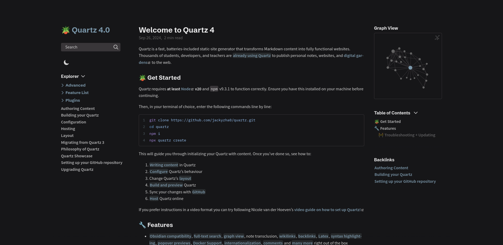
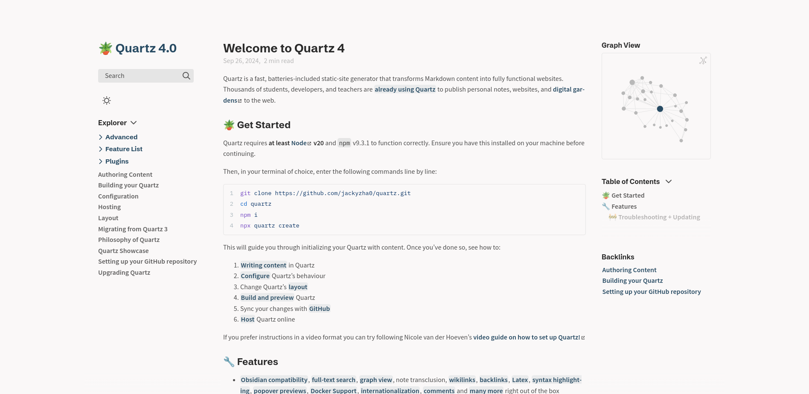

# Default

Uses the default Quartz layout.

## Usage

```scss
// In layout.scss
@import "quartz-themes/layouts/minimal";
```

## Preview

### Dark

<details>
<summary>⬛ Default Dark layout</summary>

</details>

### Light

<details>
<summary>⬜ Default Light layout</summary>

</details>
