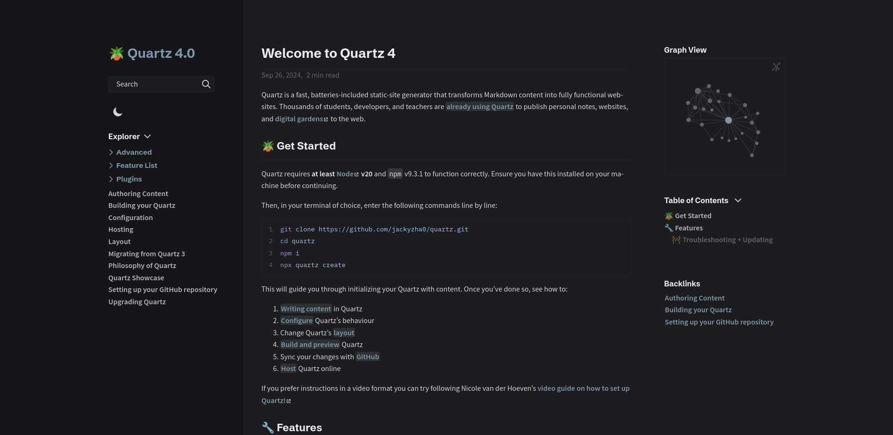
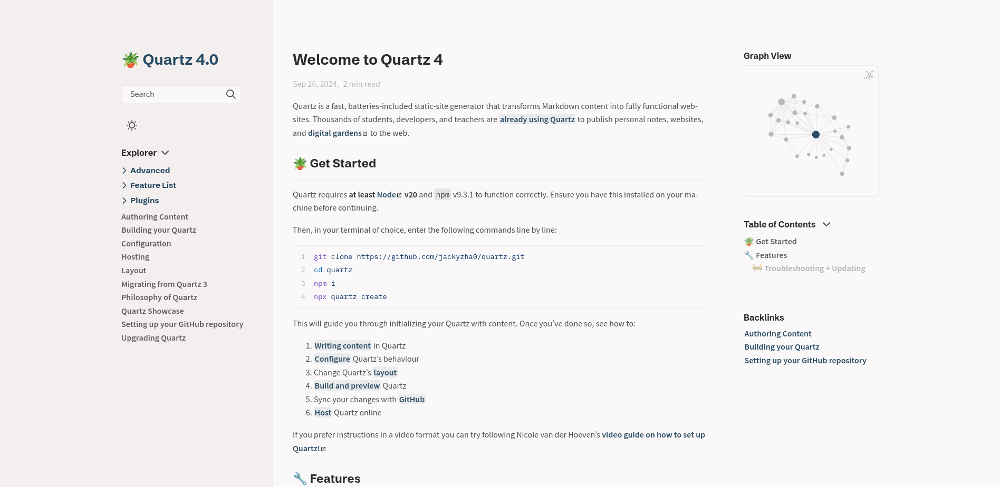

# Minimal

A layout based on [Obsidian Publish](https://obsidian.md/publish) and [Minimal theme](https://minimal.guide/home).

## Usage

```scss
// In layout.scss
@import "quartz-themes/layouts/minimal";
```

## Preview

### Dark

<details>
<summary>⬛ Minimal Dark layout</summary>

</details>

### Light

<details>
<summary>⬜ Minimal Light layout</summary>

</details>
