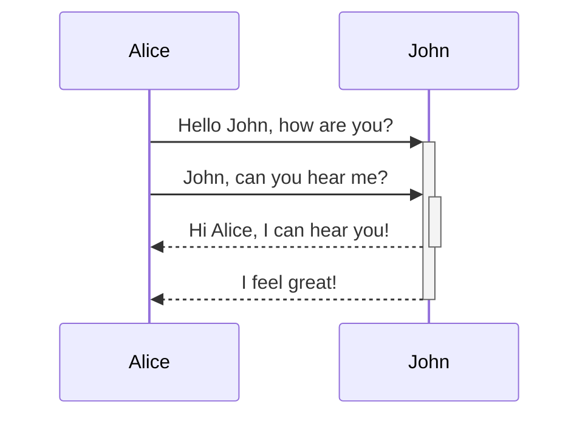

$$
\begin{vmatrix}a & b\\
c & d
\end{vmatrix}=ad-bc
$$
This is an inline math expression: $e^{2i\pi} = 1$.
<div>
<span class="quartz-graph-target" style="--quartz-graph-text:var(--graph-text);--quartz-graph-line:var(--graph-line);--quartz-graph-node:var(--graph-node);--quartz-graph-node-unresolved:var(--graph-node-unresolved);--quartz-graph-node-focused:var(--graph-node-focused);--quartz-graph-node-tag:var(--graph-node-tag);--quartz-graph-node-attachment:var(--graph-node-attachment);">text</span>
</div>

```dataviewjs
function renderGraph() {
  const explorer = document.querySelector("div.workspace-leaf-content[data-type=file-explorer]");
  if (explorer) {
    return explorer.innerHTML;
  } else {
    setTimeout(renderGraph(), 100);
  }
}
let result = renderGraph();
dv.span(result);
```

