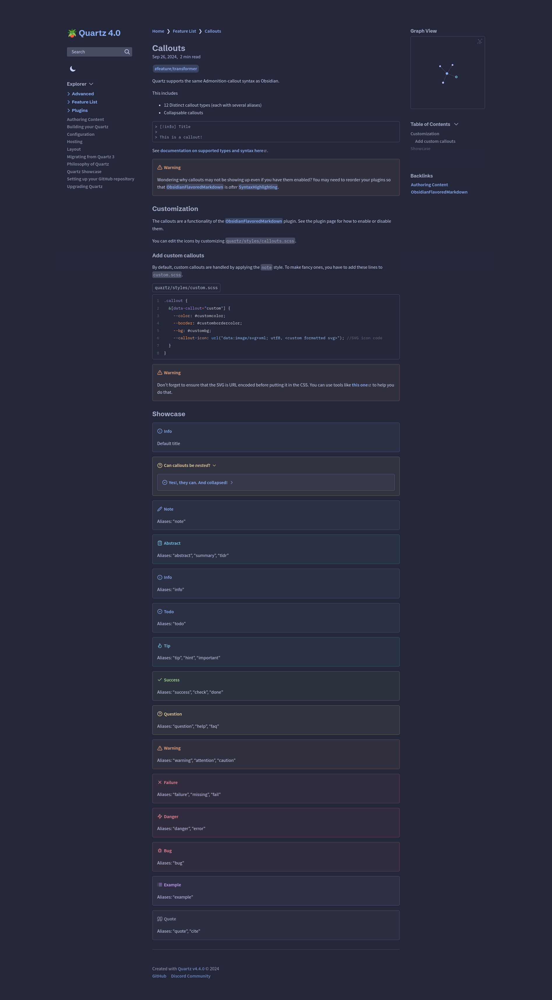

# Catppuccin

[Obsidian Theme](https://github.com/catppuccin/obsidian)

[Palette](https://catppuccin.com/palette)

- **Default**: [Mocha (DARK)](mocha/README.md)
- **Type**: `LIGHT`/`DARK`
- **Flavors**: [Frappe (DARK)](frappe/README.md), [Latte (LIGHT)](latte/README.md), [Macchiato (DARK)](macchiato/README.md), [Mocha (DARK)](mocha/README.md)

Soothing pastel theme for the high-spirited!

## Usage

### Dark

#### Frappe

```scss
// In dark.scss
@import "quartz-themes/themes/catppuccin/frappe";
```

#### Macchiato

```scss
// In dark.scss
@import "quartz-themes/themes/catppuccin/macchiato";
```

#### Mocha

```scss
// In dark.scss
@import "quartz-themes/themes/catppuccin/mocha";
```

### Light

#### Latte

```scss
// In light.scss
@import "quartz-themes/themes/catppuccin/latte";
```

## Previews

### Dark

<details>
<summary>🪴 Frappé</summary>

</details>

<details>
<summary>🌺 Macchiato</summary>

</details>

<details>
<summary>🌿 Mocha</summary>

</details>

### Light

<details>
<summary>🌻 Latte</summary>

</details>
