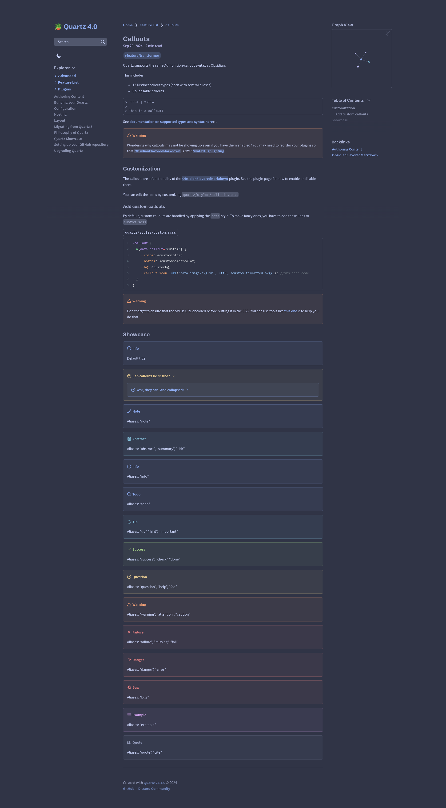

# Catppuccin/Frappe

[Obsidian Theme](https://github.com/catppuccin/obsidian)

[Palette](https://catppuccin.com/palette)

- **Main**: [Catppuccin](../README.md)
- **Type**: `DARK`

A less vibrant alternative using subdued colors for a muted aesthetic.

## Usage

```scss
// In dark.scss
@import "quartz-themes/themes/catppuccin/frappe";
```

## Preview

<details>
<summary>🪴 Frappé</summary>

</details>
