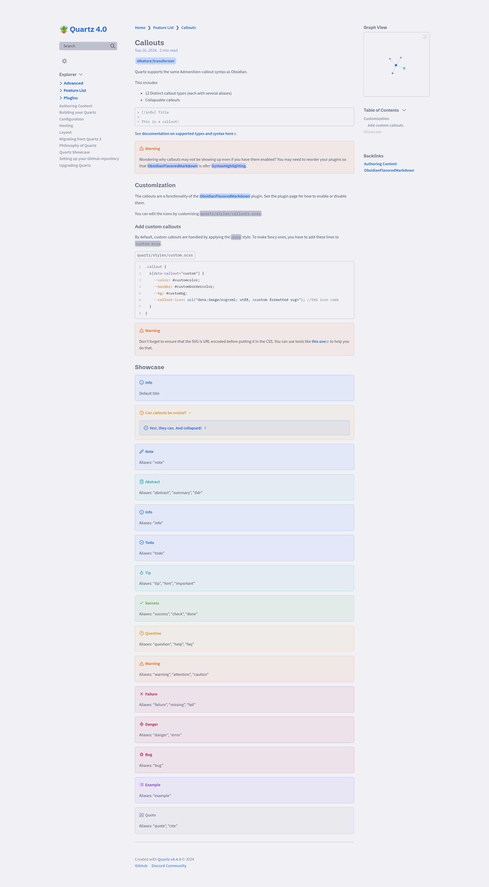

# Catppuccin/Latte

[Obsidian Theme](https://github.com/catppuccin/obsidian)

[Palette](https://catppuccin.com/palette)

- **Main**: [Catppuccin](../README.md)
- **Type**: `LIGHT`

Our lightest theme harmoniously inverting the essence of Catppuccin's dark themes.

## Usage

```scss
// In light.scss
@import "quartz-themes/themes/catppuccin/latte";
```

## Preview

<details>
<summary>🌻 Latte</summary>

</details>
