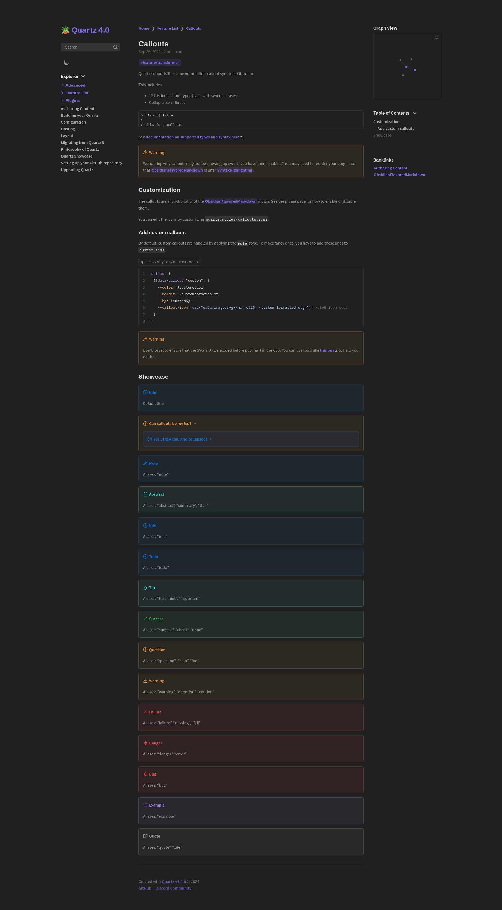
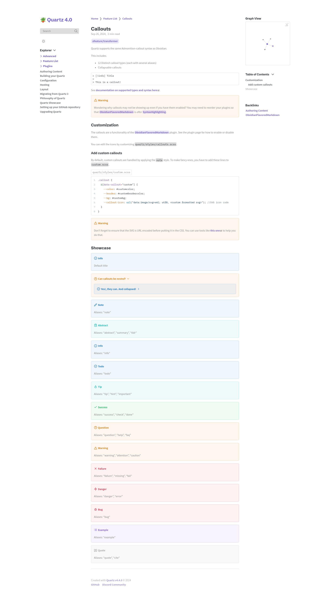

# Obsidian

[Original Repository](https://obsidian.md/)

[Palette](https://publish.obsidian.md/hub/04+-+Guides%2C+Workflows%2C+%26+Courses/Guides/Default+Obsidian+Theme+Colors)

- **Type**: `LIGHT`/`DARK`
- **Flavors**: [Light](#light), [Dark](#dark)

For those who want more Obsidian in their Quartz site. Implements the default Obsidian theme.

## Usage

### Dark

```scss
// In dark.scss
@import "quartz-themes/themes/obsidian/dark";
```

### Light

```scss
// In light.scss
@import "quartz-themes/themes/obsidian/light";
```

## Preview

### Dark

<details>
<summary>⬛ Obsidian Dark</summary>

</details>

### Light

<details>
<summary>⬜ Obsidian Light</summary>

</details>
