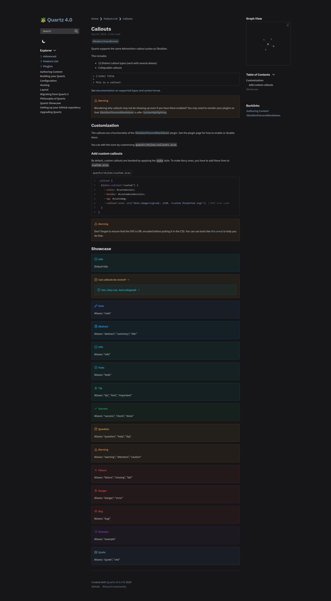
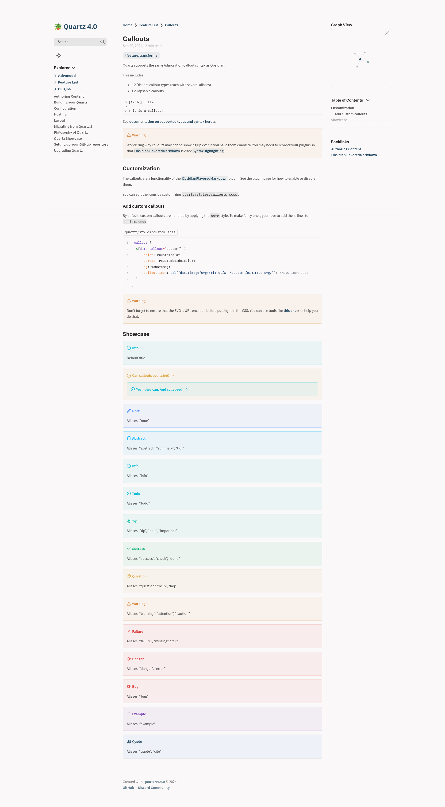

# Quartz

[Original Repository](https://github.com/jackyzha0/quartz)

- **Type**: `LIGHT`/`DARK`
- **Flavors**: [Light](#light), [Dark](#dark)

The one that started it all. Implements the default Quartz theme.

## Usage

### Dark

```scss
// In dark.scss
@import "quartz-themes/themes/quartz/dark";
```

### Light

```scss
// In light.scss
@import "quartz-themes/themes/quartz/light";
```

## Preview

### Dark

<details>
<summary>⬛ Quartz Dark</summary>

</details>

### Light

<details>
<summary>⬜ Quartz Light</summary>

</details>
