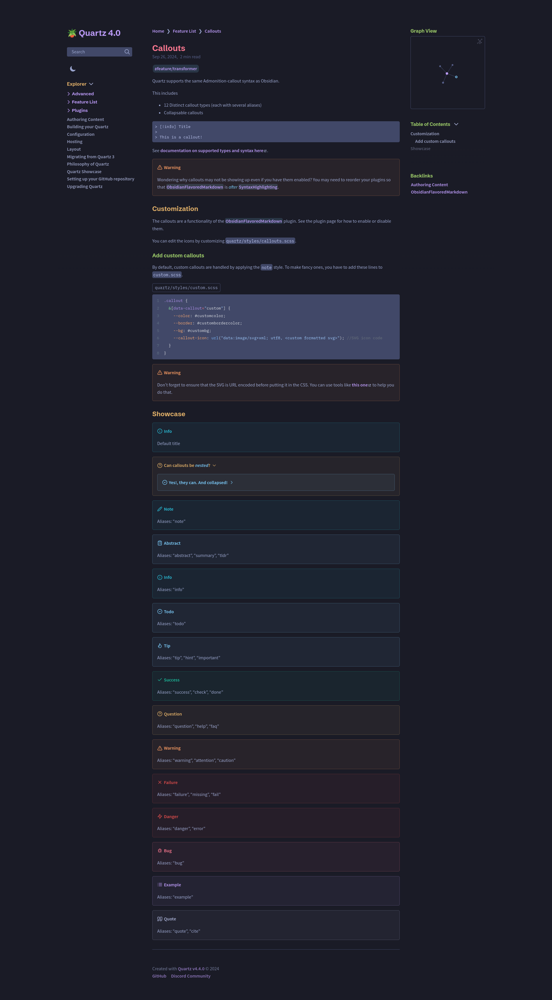
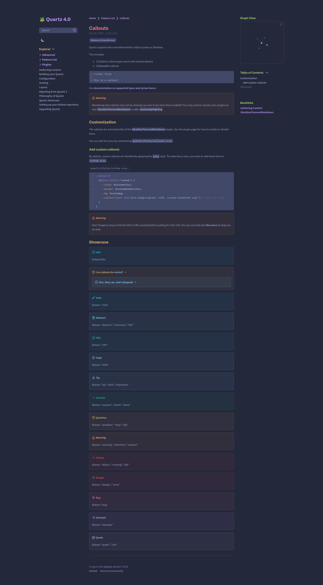
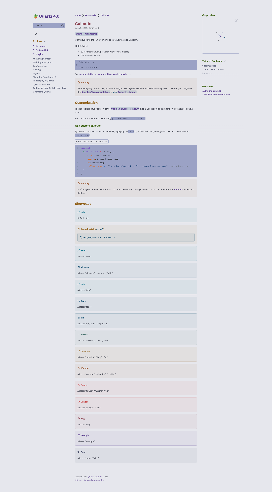

# Tokyo Night

[Obsidian Theme](https://github.com/tcmmichaelb139/obsidian-tokyonight)

[Palette](https://github.com/folke/tokyonight.nvim/tree/main/lua/tokyonight/colors)

- **Default**: [Night (DARK)](night/README.md)
- **Type**: `LIGHT`/`DARK`
- **Flavors**: [Day (LIGHT)](day/README.md), [Moon (DARK)](moon/README.md), [Night (DARK)](night/README.md), [Storm (DARK)](storm/README.md)

A clean theme that celebrates the lights of Downtown Tokyo at night.

## Usage

### Dark

#### Moon

```scss
// In dark.scss
@import "quartz-themes/themes/tokyo-night/moon";
```

#### Night

```scss
// In dark.scss
@import "quartz-themes/themes/tokyo-night/night";
```

#### Storm

```scss
// In dark.scss
@import "quartz-themes/themes/tokyo-night/storm";
```

### Light

#### Day

```scss
// In light.scss
@import "quartz-themes/themes/tokyo-night/day";
```

## Previews

### Dark

<details>
<summary>🌃 Moon</summary>

</details>

<details>
<summary>🌆 Night</summary>

</details>

<details>
<summary>🌇 Storm</summary>

</details>

### Light

<details>
<summary>🏙️ Day</summary>

</details>
