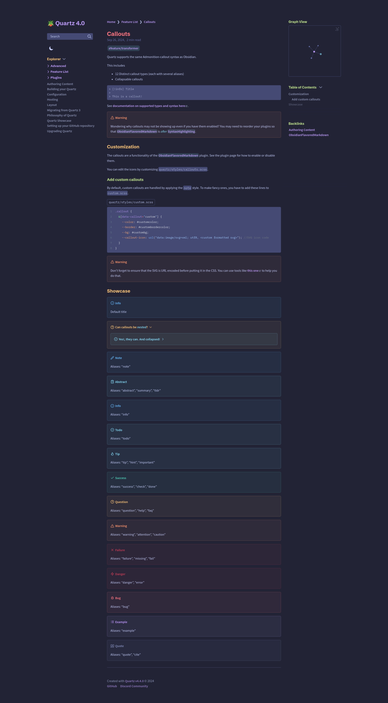

# Tokyo Night/Moon

[Obsidian Theme](https://github.com/tcmmichaelb139/obsidian-tokyonight)

[Palette](https://github.com/folke/tokyonight.nvim/blob/main/lua/tokyonight/colors/moon.lua)

- **Main**: [Tokyo Night](../README.md)
- **Type**: `DARK`

A clean theme that celebrates the lights of Downtown Tokyo at night.

## Usage

```scss
// In dark.scss
@import "quartz-themes/themes/tokyo-night/moon";
```

## Preview

<details>
<summary>🌃 Moon</summary>

</details>
